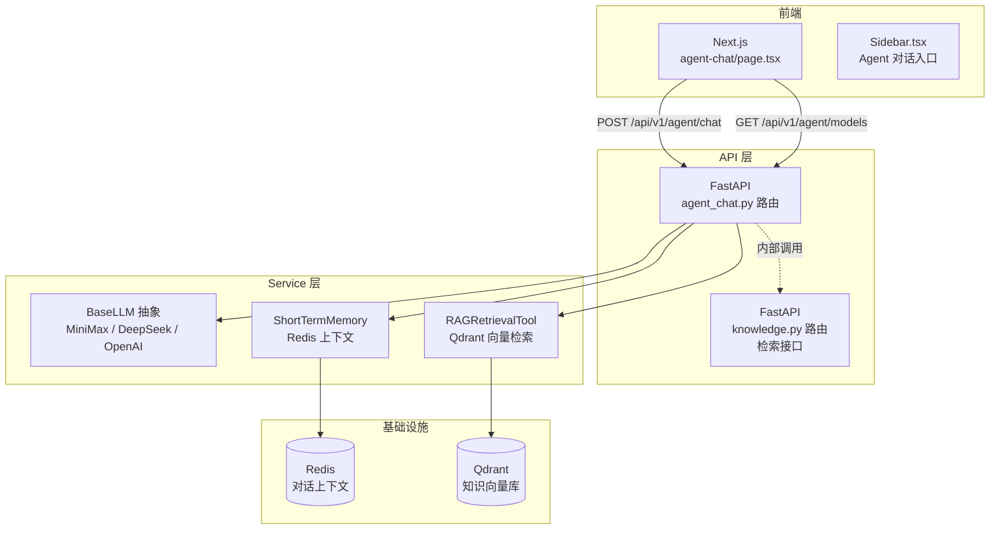
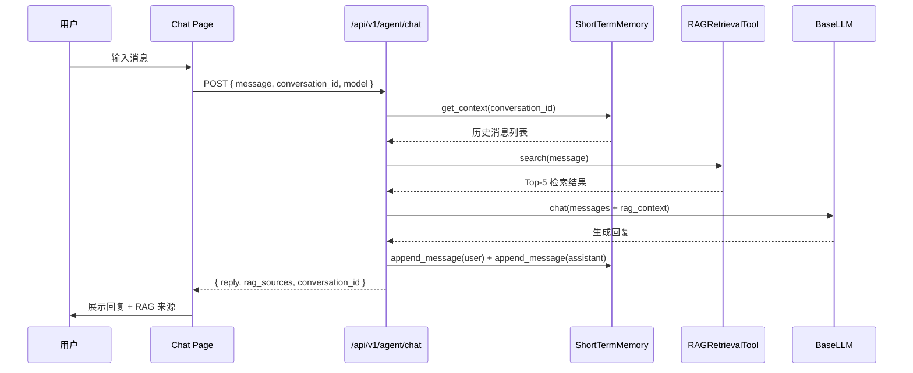

# Agent 对话系统 — 设计文档

## 概述

Agent 对话系统是连接前端对话界面与后端 RAG + LLM 能力的桥梁模块，解决"如何测试和调试 RAG 检索效果"的问题。它为商家和开发者提供一个可视化对话界面，支持多模型切换，每条消息自动触发 RAG 检索并以引用方式展示来源。

本模块核心职责：
- 前端对话界面（聊天气泡、RAG 来源展示、模型切换）
- LLM 多后端统一接入（MiniMax / DeepSeek / OpenAI）
- RAG 检索自动集成（每次消息触发检索，结果注入 LLM 上下文）
- 对话上下文管理（基于 Redis ShortTermMemory，10 轮窗口）

### 设计目标

1. 视觉一致性：对话界面完全遵循现有米粉主题设计语言，复用 DashboardUI 组件
2. 模型可替换：通过 `BaseLLM` 抽象接口接入，新增模型只需实现 `chat()` 方法
3. RAG 透明化：每次回复展示检索来源和相关度分数，便于调试
4. 渐进式增强：初始实现使用 REST 请求-响应，后续可扩展为 SSE 流式输出

---

## 架构

### Agent Chat 在系统中的位置



### 对话请求流程



---

## 组件与接口

### 1. API 路由层（`backend/app/api/v1/agent_chat.py`）

路由层只做参数校验和响应封装，对话编排逻辑委托给内部函数。

| Method | Path | 说明 | 认证 |
|--------|------|------|------|
| POST | `/api/v1/agent/chat` | 发送消息，返回 AI 回复 + RAG 来源 | JWT |
| GET | `/api/v1/agent/models` | 获取可用模型列表及可用状态 | JWT |

#### POST `/api/v1/agent/chat` 处理流程

```
1. 校验参数 (message 1-2000 chars, conversation_id 1-128 chars, model 1-64 chars)
2. 从 ShortTermMemory 加载历史对话上下文
3. 调用 RAGRetrievalTool.search(query=message) 获取相关知识片段
4. 格式化上下文 + RAG 结果为提示词文本
5. 根据 model 参数选择对应的 BaseLLM 实现
6. 调用 LLM.chat(messages) 生成回复
7. 将本轮 user/assistant 消息追加到 ShortTermMemory
8. 返回 AgentChatResponse
```

### 2. LLM 适配层

已有 `agent/llm/base.py` 定义 `BaseLLM` 抽象接口，需要实现三个具体类：

```python
class BaseLLM(ABC):
    async def chat(self, messages: list[dict], **kwargs) -> str: ...
    async def function_call(self, messages: list[dict], tools: list[dict], **kwargs) -> dict: ...
```

| 实现类 | 文件 | 模型 ID | API 地址 |
|--------|------|---------|----------|
| `MiniMaxLLM` | `agent/llm/minimax_llm.py` | `minimax-abab6.5s` | MiniMax API |
| `DeepSeekLLM` | `agent/llm/deepseek_llm.py` | `deepseek-chat` | DeepSeek API |
| `OpenAILLM` | `agent/llm/openai_llm.py` | `gpt-4o` | OpenAI API |

所有实现类遵循相同模式：
- `__init__` 从 `app.config.settings` 读取 API Key 和模型名
- `chat()` 将消息字典列表转换为对应 SDK 的格式，调用 `ainvoke`，返回文本
- 调用失败时抛出明确异常，包含模型名称和错误信息

### 3. RAG 检索工具（`agent/tools/rag_retrieval.py`）

```python
class RAGRetrievalTool:
    async def search(self, query: str, collection_name: str = "knowledge_chunks") -> list[dict]:
        """在 Qdrant 中执行语义检索，返回 Top-5 结果。"""
```

检索逻辑：
1. 使用 `langchain_openai.OpenAIEmbeddings` 将 query 向量化
2. 在 Qdrant 指定 collection 中执行相似度搜索
3. 过滤 score < 0.6 的结果
4. 返回格式：`[{ content, score, source_doc_id }]`
5. Collection 不存在时返回空列表，不抛异常

### 4. 前端组件树

```
app/(dashboard)/agent-chat/page.tsx          # 对话页面（client component）
├── SectionCard (from DashboardUI)            # 外层卡片容器
│   ├── Header                                # 标题 + 模型选择器 + 新对话按钮
│   ├── MessageList                           # 消息列表（scrollable）
│   │   ├── EmptyState                        # 空状态引导
│   │   ├── UserBubble                        # 用户消息（右对齐，粉色）
│   │   ├── AssistantBubble                   # AI 回复（左对齐，灰色）
│   │   │   └── RagSourcePanel               # RAG 来源折叠面板
│   │   └── LoadingIndicator                  # 三圆点跳动
│   └── InputArea                             # 输入框 + 发送按钮
```

### 5. 前端状态管理

所有状态为组件本地状态（useState），不引入全局状态库：

| 状态 | 类型 | 说明 |
|------|------|------|
| `messages` | `Message[]` | 当前会话的消息列表 |
| `input` | `string` | 输入框文本 |
| `isLoading` | `boolean` | 是否等待回复中 |
| `conversationId` | `string` | 会话 ID（localStorage 持久化） |
| `selectedModel` | `string` | 当前选中的模型 ID |

---

## 数据模型

### Pydantic Schema（后端）

```python
# backend/app/schemas/agent_chat.py

class AgentChatRequest(BaseModel):
    message: str = Field(..., min_length=1, max_length=2000)
    conversation_id: str = Field(..., min_length=1, max_length=128)
    model: str = Field(default="minimax-abab6.5s", max_length=64)

class RagSource(BaseModel):
    content: str
    score: float
    source_doc_id: str | None = None

class AgentChatResponse(BaseModel):
    reply: str
    rag_sources: list[RagSource]
    conversation_id: str
    model: str
    tokens_used: int = 0

class ModelInfo(BaseModel):
    id: str
    name: str
    available: bool

class ModelsResponse(BaseModel):
    models: list[ModelInfo]
```

### TypeScript 类型（前端）

```typescript
interface Message {
  id: string;
  role: "user" | "assistant";
  content: string;
  ragSources?: RagSource[];
  timestamp: number;
}

interface RagSource {
  content: string;
  score: number;
  source_doc_id: string | null;
}

interface ChatResponse {
  reply: string;
  rag_sources: RagSource[];
  conversation_id: string;
  model: string;
  tokens_used: number;
}
```

---

## 关键流程

### 模型选择器行为

```
用户点击模型选择器
  → 下拉菜单展示所有可用模型（从 GET /api/v1/agent/models 获取）
  → 标注各模型可用状态（绿色圆点 / 灰色不可用）
  → 用户选择模型 → 更新 selectedModel 状态
  → 后续 POST /chat 请求携带选中的 model 参数
  → 切换模型不清空历史消息
```

### 错误处理决策树

```
POST /api/v1/agent/chat 请求
  ├── 网络错误 → "网络连接失败，请检查网络"（保留输入框文字）
  ├── 401 → 自动重定向到 /login（api-client 统一处理）
  ├── 40102 LLM 调用失败 → "模型 [name] 调用失败：{原因}"
  ├── 40101 RAG 检索失败 → 降级处理：rag_sources=[]，LLM 仍可用
  └── 200 → 正常展示回复
```

### 对话 ID 生命周期

```
首次访问页面
  → crypto.randomUUID() 生成 conversation_id
  → 存入 localStorage["agent_conversation_id"]
  → 页面刷新 → 从 localStorage 读取，恢复对话上下文
  → 点击"新对话" → 生成新 ID，更新 localStorage，清空 messages 状态
  → 旧 conversation_id 对应的 Redis 数据在 24h TTL 后自动清理
```

---

## 正确性属性

| 属性 ID | 属性描述 | 对应需求 |
|---------|----------|----------|
| AG-P1 | 模型切换不影响已有消息，仅后续请求使用新模型 | AG3 |
| AG-P2 | 检索结果全低于 0.6 时仍返回 LLM 回复，rag_sources 为空数组 | AG4 |
| AG-P3 | 超过 10 轮对话时自动截断最旧记录，Redis TTL 24h | AG5 |
| AG-P4 | 页面刷新后 conversation_id 不变，上下文可恢复 | AG5 |
| AG-P5 | 请求失败时输入框文字不丢失 | AG2 |
| AG-P6 | 新增 LLM 后端只需实现 BaseLLM 接口 | AG3 |

---

## 设计补充

1. **为什么默认使用 MiniMax？** — 用户偏好，且 MiniMax 在中文场景表现好。同时保留 DeepSeek 和 GPT-4o 作为可选切换项。

2. **为什么不使用 SSE 流式输出？** — 初始版本使用简单的请求-响应模式，降低实现复杂度。后续可在 AgentChatResponse 中增加 streaming 支持，前端使用 EventSource 读取。

3. **为什么 RAG 检索失败不阻塞对话？** — 对话系统的核心价值是能与 Agent 交流。RAG 缺失时 LLM 仍可用通用知识回复，不影响对话连续性。检索失败仅记录日志并将 `rag_sources` 置为空数组。

4. **为什么使用 module-level singleton 而非依赖注入？** — 当前项目处于早期阶段，尚未引入 DI 容器。module-level singleton（ShortTermMemory、RAGRetrievalTool、BaseLLM 实例）在 FastAPI 的 async 环境下可安全使用，且与现有代码风格一致。
