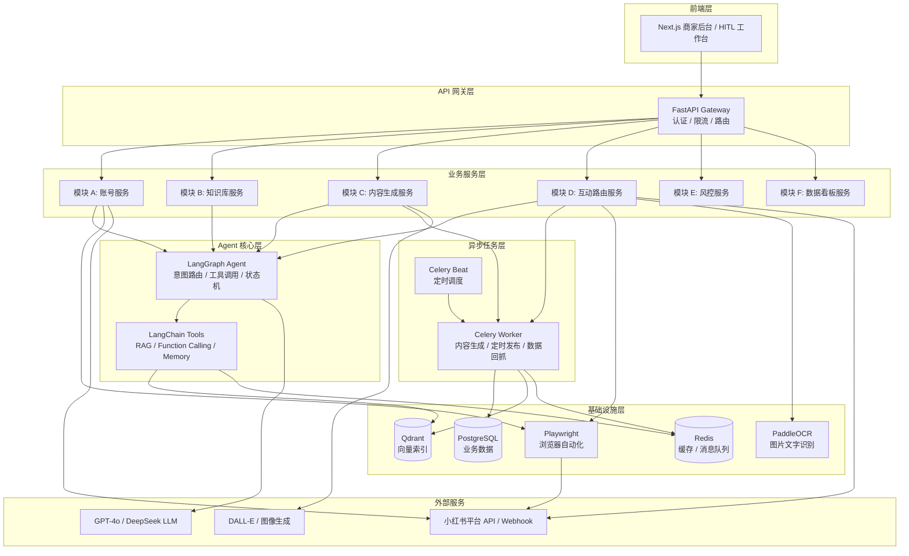
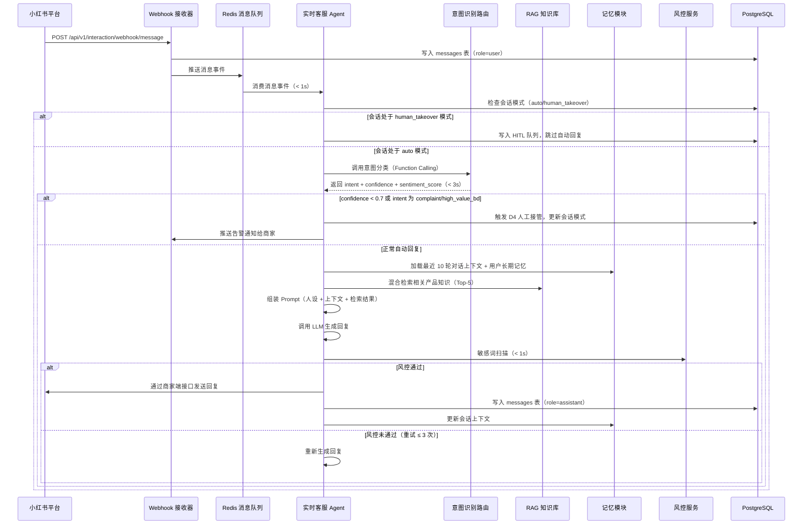
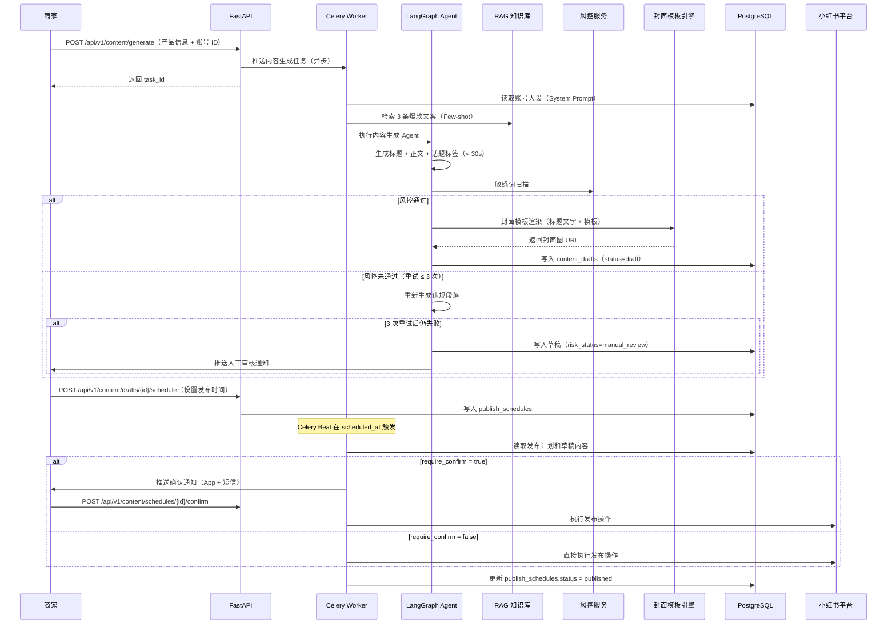
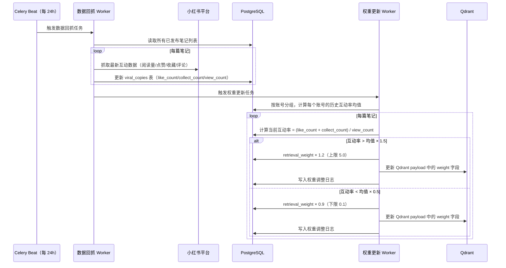

# 小红书营销自动化 Agent — 架构设计文档

## 概述

本系统是一个面向小红书商家的营销自动化智能体平台，覆盖账号管理、内容生产、互动回复、风控合规和数据分析五大业务域。系统以 LangGraph 驱动的 Agent 为核心大脑，通过 FastAPI 提供 RESTful 服务，Celery 承载异步任务，Next.js 提供商家后台和 HITL 工作台。

---

## 架构

### 整体分层架构



### 模块职责边界

| 模块 | 职责 | 对外依赖 |
|------|------|----------|
| A 账号服务 | OAuth 授权、Cookie 管理、代理配置、账号画像同步、状态监控 | Playwright、小红书 API |
| B 知识库服务 | 文档解析分块、向量索引、混合检索、爆款文案权重管理、对话记忆、行业爆款采集、趋势分析与选题建议 | Qdrant、PostgreSQL、Playwright |
| C 内容生成服务 | 文案生成、封面模板渲染、发布调度、草稿管理 | LLM、DALL-E、Pillow、Celery |
| D 互动路由服务 | 评论监听、OCR 识别、意图分类、私信触发、实时客服、人工接管 | LangGraph、PaddleOCR、Playwright |
| E 风控服务 | 敏感词扫描、频率限制、内容去重、竞品过滤 | Redis（频率计数）、PostgreSQL |
| F 数据看板服务 | 转化漏斗统计、HITL 审核工作台、告警中心、数据导出 | PostgreSQL、Redis |

### 模块间通信方式

- **同步 REST**：前端 → API 网关 → 各业务服务；业务服务间直接调用（如 D 调用 B 检索、D 调用 E 风控）
- **异步消息队列（Celery + Redis）**：内容生成任务、定时发布任务、数据回抓任务、告警推送任务
- **事件驱动（Redis Pub/Sub）**：账号状态变更通知、实时客服消息推送至前端 WebSocket

---

## 技术栈选型

| 技术 | 选型 | 理由 |
|------|------|------|
| 后端框架 | FastAPI | 原生异步支持，自动生成 OpenAPI 文档，与 Pydantic 深度集成，适合高并发 IO 密集型服务 |
| Agent 框架 | LangGraph + LangChain | LangGraph 提供有状态的 Agent 工作流（状态机），适合多步骤意图路由；LangChain 提供工具链和 RAG 组件 |
| LLM | GPT-4o（默认） | Function Calling 能力强，支持中文；接口层抽象为 `BaseLLM`，可替换 DeepSeek、Qwen 等国产模型 |
| 向量数据库 | Qdrant | 支持混合搜索（向量 + 稀疏向量 BM25），原生支持 payload 过滤，Docker 部署简单 |
| 关系型数据库 | PostgreSQL | 支持 JSONB 存储非结构化字段，pg_trgm 支持模糊匹配，成熟的事务和审计能力 |
| 缓存 | Redis | 频率计数（INCR + TTL）、会话上下文缓存、Celery Broker、Pub/Sub 实时推送 |
| 消息队列 | Celery + Redis | 与 FastAPI 生态兼容，支持定时任务（Beat）、任务重试和优先级队列 |
| 浏览器自动化 | Playwright | 支持多浏览器上下文隔离（对应多账号），异步 API，设备指纹配置灵活 |
| OCR | PaddleOCR | 中文识别精度高，支持置信度输出，可本地部署无需外部 API |
| 图像生成 | DALL-E API + Pillow | DALL-E 生成 AI 配图；Pillow 负责封面模板文字合成（确定性渲染，无需 AI） |
| 前端 | Next.js (App Router) | SSR 支持 SEO，React Server Components 减少客户端 JS，适合数据看板和实时会话列表 |

---

## 数据模型

### PostgreSQL 核心表设计

#### accounts（账号表）
| 字段 | 类型 | 说明 |
|------|------|------|
| id | UUID PK | 账号唯一标识 |
| merchant_id | UUID FK | 所属商家 |
| xhs_user_id | VARCHAR(64) | 小红书平台用户 ID |
| nickname | VARCHAR(128) | 账号昵称 |
| access_type | ENUM('oauth','rpa','browser') | 接入方式 |
| oauth_token_enc | TEXT | 加密存储的 OAuth Token |
| cookie_enc | TEXT | 加密存储的 Cookie |
| cookie_expires_at | TIMESTAMPTZ | Cookie 过期时间 |
| status | ENUM('active','suspended','auth_expired','banned') | 账号状态 |
| last_probed_at | TIMESTAMPTZ | 最近一次状态探测时间 |
| created_at | TIMESTAMPTZ | 创建时间 |

#### account_personas（账号人设表）
| 字段 | 类型 | 说明 |
|------|------|------|
| id | UUID PK | 人设唯一标识 |
| account_id | UUID FK | 关联账号 |
| tone | VARCHAR(64) | 语气风格（专业/活泼/种草风） |
| system_prompt | TEXT | 注入 LLM 的 System Prompt 全文 |
| bio | TEXT | 账号简介 |
| tags | TEXT[] | 账号标签数组 |
| follower_count | INT | 粉丝数（定期刷新） |
| profile_synced_at | TIMESTAMPTZ | 画像最近同步时间 |

#### proxy_configs（代理配置表）
| 字段 | 类型 | 说明 |
|------|------|------|
| id | UUID PK | 配置唯一标识 |
| account_id | UUID FK UNIQUE | 关联账号（一对一） |
| proxy_url | TEXT | 代理地址（含认证信息，加密存储） |
| user_agent | TEXT | 浏览器 UA |
| screen_resolution | VARCHAR(16) | 屏幕分辨率，如 1920x1080 |
| timezone | VARCHAR(64) | 时区，如 Asia/Shanghai |
| is_active | BOOLEAN | 是否启用 |

#### knowledge_documents（知识库文档表）
| 字段 | 类型 | 说明 |
|------|------|------|
| id | UUID PK | 文档唯一标识 |
| merchant_id | UUID FK | 所属商家 |
| title | VARCHAR(256) | 文档标题 |
| source_type | ENUM('pdf','docx','markdown','text','url') | 来源格式 |
| source_url | TEXT | 原始 URL（URL 类型时使用） |
| file_path | TEXT | 存储路径 |
| index_status | ENUM('pending','indexing','indexed','failed') | 索引状态 |
| indexed_at | TIMESTAMPTZ | 索引完成时间 |
| created_at | TIMESTAMPTZ | 上传时间 |

#### knowledge_chunks（文档分块表）
| 字段 | 类型 | 说明 |
|------|------|------|
| id | UUID PK | 分块唯一标识 |
| document_id | UUID FK | 所属文档 |
| chunk_index | INT | 分块序号 |
| content | TEXT | 分块文本内容 |
| token_count | INT | Token 数量（≤ 512） |
| qdrant_point_id | UUID | 对应 Qdrant 向量点 ID |
| created_at | TIMESTAMPTZ | 创建时间 |

#### viral_copies（爆款文案表）
| 字段 | 类型 | 说明 |
|------|------|------|
| id | UUID PK | 文案唯一标识 |
| account_id | UUID FK | 关联账号 |
| xhs_note_id | VARCHAR(64) | 小红书笔记 ID |
| title | TEXT | 笔记标题 |
| content | TEXT | 笔记正文 |
| like_count | INT | 点赞数 |
| collect_count | INT | 收藏数 |
| view_count | INT | 阅读量 |
| engagement_rate | FLOAT | 互动率（点赞+收藏）/阅读量 |
| retrieval_weight | FLOAT DEFAULT 1.0 | 检索权重（动态调整） |
| published_at | TIMESTAMPTZ | 发布时间 |
| last_synced_at | TIMESTAMPTZ | 最近数据同步时间 |

#### industry_notes（行业爆款笔记表）
| 字段 | 类型 | 说明 |
|------|------|------|
| id | UUID PK | 记录唯一标识 |
| merchant_id | UUID FK | 所属商家（按商家隔离数据） |
| industry_keyword | VARCHAR(64) | 采集时使用的行业关键词 |
| xhs_note_id | VARCHAR(64) | 小红书笔记 ID |
| title | TEXT | 笔记标题 |
| summary | TEXT | 正文摘要（前 300 字） |
| hashtags | TEXT[] | 话题标签数组 |
| cover_style | VARCHAR(32) | 封面风格标签（real_person/product_flat/mixed） |
| like_count | INT | 点赞数 |
| collect_count | INT | 收藏数 |
| comment_count | INT | 评论数 |
| author_follower_tier | VARCHAR(16) | 作者粉丝量级（kol/koc/normal） |
| published_at | TIMESTAMPTZ | 笔记发布时间 |
| crawled_at | TIMESTAMPTZ | 采集时间 |
| qdrant_point_id | UUID | 对应 Qdrant 向量点 ID（行业集合） |

#### topic_suggestions（选题建议表）
| 字段 | 类型 | 说明 |
|------|------|------|
| id | UUID PK | 建议唯一标识 |
| merchant_id | UUID FK | 所属商家 |
| industry_keyword | VARCHAR(64) | 分析时使用的行业关键词 |
| input_keyword | VARCHAR(128) | 商家输入的选题关键词 |
| suggested_title | TEXT | 推荐标题 |
| selling_angle | TEXT | 核心卖点角度描述 |
| suggested_hashtags | TEXT[] | 建议话题标签（3-5 个） |
| viral_score | SMALLINT | 爆款潜力评分（0-100） |
| ref_note_ids | UUID[] | 参考爆款笔记 ID 数组（来自 industry_notes） |
| created_at | TIMESTAMPTZ | 生成时间 |

#### content_drafts（内容草稿表）
| 字段 | 类型 | 说明 |
|------|------|------|
| id | UUID PK | 草稿唯一标识 |
| account_id | UUID FK | 关联账号 |
| title | TEXT | 笔记标题 |
| body | TEXT | 正文内容 |
| alt_titles | TEXT[] | 备选标题数组（最多 3 个） |
| hashtags | TEXT[] | 话题标签数组 |
| cover_image_url | TEXT | 封面图片 URL |
| content_type | ENUM('image_text','video','moment') | 内容形式 |
| risk_status | ENUM('pending','passed','failed','manual_review') | 风控状态 |
| status | ENUM('draft','scheduled','published','failed') | 草稿状态 |
| created_at | TIMESTAMPTZ | 创建时间 |

#### publish_schedules（发布计划表）
| 字段 | 类型 | 说明 |
|------|------|------|
| id | UUID PK | 计划唯一标识 |
| draft_id | UUID FK | 关联草稿 |
| account_id | UUID FK | 关联账号 |
| scheduled_at | TIMESTAMPTZ | 计划发布时间 |
| require_confirm | BOOLEAN | 是否需要人工确认 |
| confirm_deadline | TIMESTAMPTZ | 确认截止时间（scheduled_at + 2h） |
| confirmed_at | TIMESTAMPTZ | 实际确认时间 |
| executed_at | TIMESTAMPTZ | 实际执行时间 |
| status | ENUM('waiting','confirmed','published','timeout','failed') | 计划状态 |

#### comments（评论记录表）
| 字段 | 类型 | 说明 |
|------|------|------|
| id | UUID PK | 评论唯一标识 |
| account_id | UUID FK | 被评论的账号 |
| xhs_note_id | VARCHAR(64) | 所属笔记 ID |
| xhs_comment_id | VARCHAR(64) UNIQUE | 小红书评论 ID |
| xhs_user_id | VARCHAR(64) | 评论用户 ID |
| content | TEXT | 评论文本内容 |
| image_urls | TEXT[] | 评论图片 URL 数组 |
| ocr_result | TEXT | OCR 提取文字 |
| intent | VARCHAR(32) | 意图分类结果 |
| intent_confidence | FLOAT | 意图置信度 |
| sentiment_score | FLOAT | 情绪分数（-1.0 ~ 1.0） |
| reply_status | ENUM('pending','replied','manual_review','skipped') | 回复状态 |
| detected_at | TIMESTAMPTZ | 检测到评论的时间 |

#### conversations（私信会话表）
| 字段 | 类型 | 说明 |
|------|------|------|
| id | UUID PK | 会话唯一标识 |
| account_id | UUID FK | 商家账号 |
| xhs_user_id | VARCHAR(64) | 对话用户 ID |
| mode | ENUM('auto','human_takeover','pending') | 会话模式 |
| user_long_term_memory | JSONB | 用户长期记忆（偏好标签、历史意向） |
| last_message_at | TIMESTAMPTZ | 最近消息时间 |
| created_at | TIMESTAMPTZ | 会话创建时间 |

#### messages（消息记录表）
| 字段 | 类型 | 说明 |
|------|------|------|
| id | UUID PK | 消息唯一标识 |
| conversation_id | UUID FK | 所属会话 |
| role | ENUM('user','assistant') | 消息角色 |
| content | TEXT | 消息内容 |
| intent | VARCHAR(32) | 意图分类（仅 user 消息） |
| intent_confidence | FLOAT | 意图置信度 |
| sentiment_score | FLOAT | 情绪分数 |
| sent_at | TIMESTAMPTZ | 发送时间 |

#### intent_logs（意图识别日志表）
| 字段 | 类型 | 说明 |
|------|------|------|
| id | UUID PK | 日志唯一标识 |
| source_type | ENUM('comment','message') | 来源类型 |
| source_id | UUID | 来源记录 ID |
| raw_input | TEXT | 原始输入文本 |
| intent | VARCHAR(32) | 识别结果 |
| confidence | FLOAT | 置信度 |
| sentiment_score | FLOAT | 情绪分数 |
| llm_latency_ms | INT | LLM 调用耗时（毫秒） |
| created_at | TIMESTAMPTZ | 记录时间 |

#### risk_keywords（风控关键词表）
| 字段 | 类型 | 说明 |
|------|------|------|
| id | UUID PK | 关键词唯一标识 |
| merchant_id | UUID FK | 所属商家（NULL 表示系统级） |
| keyword | VARCHAR(128) | 关键词 |
| category | ENUM('platform_banned','exaggeration','competitor','custom') | 关键词类别 |
| replacement | VARCHAR(128) | 建议替换词 |
| is_active | BOOLEAN | 是否启用 |
| created_at | TIMESTAMPTZ | 创建时间 |

#### operation_logs（操作日志表）
| 字段 | 类型 | 说明 |
|------|------|------|
| id | UUID PK | 日志唯一标识 |
| account_id | UUID FK | 关联账号 |
| operation_type | VARCHAR(64) | 操作类型（publish/reply/dm_send 等） |
| status | ENUM('success','failed','skipped') | 执行状态 |
| detail | JSONB | 操作详情（输入输出、耗时、token 消耗） |
| error_code | VARCHAR(32) | 错误码（失败时） |
| created_at | TIMESTAMPTZ | 操作时间 |

#### alerts（告警记录表）
| 字段 | 类型 | 说明 |
|------|------|------|
| id | UUID PK | 告警唯一标识 |
| merchant_id | UUID FK | 所属商家 |
| alert_type | VARCHAR(64) | 告警类型（account_banned/rate_limit/llm_quota 等） |
| module | VARCHAR(32) | 触发模块（A/B/C/D/E/F） |
| severity | ENUM('info','warning','critical') | 严重级别 |
| message | TEXT | 告警消息 |
| is_resolved | BOOLEAN | 是否已处理 |
| resolved_by | UUID | 处理人 |
| resolved_at | TIMESTAMPTZ | 处理时间 |
| created_at | TIMESTAMPTZ | 告警时间 |

---

## API 设计

### 账号管理 API

| Method | Path | 说明 |
|--------|------|------|
| GET | /api/v1/accounts | 获取商家所有账号列表 |
| POST | /api/v1/accounts | 新增账号（指定接入方式） |
| GET | /api/v1/accounts/{id} | 获取账号详情 |
| DELETE | /api/v1/accounts/{id} | 删除账号 |
| POST | /api/v1/accounts/{id}/oauth/callback | OAuth 2.0 授权回调 |
| PUT | /api/v1/accounts/{id}/cookie | 更新账号 Cookie |
| GET | /api/v1/accounts/{id}/status | 获取账号当前状态 |
| POST | /api/v1/accounts/{id}/sync-profile | 手动触发账号画像同步 |
| PUT | /api/v1/accounts/{id}/persona | 更新账号人设配置 |
| PUT | /api/v1/accounts/{id}/proxy | 更新代理配置 |

### 知识库管理 API

| Method | Path | 说明 |
|--------|------|------|
| GET | /api/v1/knowledge/documents | 获取文档列表 |
| POST | /api/v1/knowledge/documents | 上传新文档（multipart/form-data） |
| DELETE | /api/v1/knowledge/documents/{id} | 删除文档及其向量索引 |
| POST | /api/v1/knowledge/documents/{id}/reindex | 重新索引指定文档 |
| GET | /api/v1/knowledge/viral-copies | 获取爆款文案列表 |
| POST | /api/v1/knowledge/viral-copies | 手动添加爆款文案 |
| POST | /api/v1/knowledge/search | 执行混合检索（返回 Top-5） |
| GET | /api/v1/knowledge/industry-keywords | 获取商家配置的行业关键词列表 |
| POST | /api/v1/knowledge/industry-keywords | 添加行业关键词 |
| DELETE | /api/v1/knowledge/industry-keywords/{keyword} | 删除行业关键词 |
| POST | /api/v1/knowledge/industry/crawl | 手动触发行业爆款采集任务 |
| GET | /api/v1/knowledge/industry/notes | 获取已采集的行业爆款笔记列表（支持按关键词/时间筛选） |
| GET | /api/v1/knowledge/industry/trends | 获取行业趋势分析报告（高频标签/标题结构/最佳发布时间/封面风格） |
| POST | /api/v1/knowledge/industry/suggest | 提交选题关键词，获取选题建议列表 |
| GET | /api/v1/knowledge/industry/suggestions | 获取历史选题建议记录 |

### 内容生成与发布 API

| Method | Path | 说明 |
|--------|------|------|
| POST | /api/v1/content/generate | 提交内容生成任务（异步，返回 task_id） |
| GET | /api/v1/content/tasks/{task_id} | 查询生成任务状态和结果 |
| GET | /api/v1/content/drafts | 获取草稿列表 |
| GET | /api/v1/content/drafts/{id} | 获取草稿详情 |
| PUT | /api/v1/content/drafts/{id} | 更新草稿内容 |
| DELETE | /api/v1/content/drafts/{id} | 删除草稿 |
| POST | /api/v1/content/drafts/{id}/schedule | 为草稿创建发布计划 |
| POST | /api/v1/content/drafts/{id}/publish-now | 立即发布草稿 |
| GET | /api/v1/content/schedules | 获取发布计划列表 |
| DELETE | /api/v1/content/schedules/{id} | 取消发布计划 |
| POST | /api/v1/content/schedules/{id}/confirm | 人工确认发布 |
| POST | /api/v1/content/cover/render | 渲染封面图（同步，返回图片 URL） |

### 互动与客服 API

| Method | Path | 说明 |
|--------|------|------|
| GET | /api/v1/interaction/comments | 获取评论列表（支持按状态筛选） |
| GET | /api/v1/interaction/conversations | 获取私信会话列表 |
| GET | /api/v1/interaction/conversations/{id}/messages | 获取会话消息记录 |
| POST | /api/v1/interaction/conversations/{id}/takeover | 切换为人工接管模式 |
| POST | /api/v1/interaction/conversations/{id}/release | 解除人工接管 |
| POST | /api/v1/interaction/webhook/message | 接收小红书消息 Webhook（D5 入口） |
| GET | /api/v1/interaction/hitl/queue | 获取 HITL 待审核队列 |
| POST | /api/v1/interaction/hitl/{id}/approve | 审核通过并发送 |
| POST | /api/v1/interaction/hitl/{id}/edit-approve | 修改后通过并发送 |
| POST | /api/v1/interaction/hitl/{id}/reject | 拒绝回复 |
| POST | /api/v1/interaction/hitl/batch-approve | 批量审核通过 |

### 风控配置 API

| Method | Path | 说明 |
|--------|------|------|
| GET | /api/v1/risk/keywords | 获取风控关键词列表 |
| POST | /api/v1/risk/keywords | 添加关键词 |
| PUT | /api/v1/risk/keywords/{id} | 更新关键词 |
| DELETE | /api/v1/risk/keywords/{id} | 删除关键词 |
| POST | /api/v1/risk/scan | 对指定文本执行风控扫描（同步） |
| GET | /api/v1/risk/rate-limits | 获取各账号当前频率使用情况 |

### 数据看板 API

| Method | Path | 说明 |
|--------|------|------|
| GET | /api/v1/analytics/funnel | 获取转化漏斗数据（支持按账号/时间范围筛选） |
| GET | /api/v1/analytics/notes | 获取笔记互动数据列表 |
| GET | /api/v1/analytics/llm-usage | 获取 LLM 调用统计（token 消耗、耗时） |
| GET | /api/v1/analytics/export | 导出统计数据（CSV） |
| GET | /api/v1/analytics/alerts | 获取告警历史记录 |
| PUT | /api/v1/analytics/alerts/{id}/resolve | 标记告警为已处理 |
| GET | /api/v1/analytics/system-status | 获取系统实时运行状态 |

---

## 代码目录结构

```
xiaohongshu-marketing-agent/
├── backend/                      # FastAPI 后端
│   ├── app/
│   │   ├── main.py               # FastAPI 应用入口
│   │   ├── config.py             # 配置管理（pydantic-settings）
│   │   ├── dependencies.py       # 依赖注入（DB session、认证）
│   │   ├── api/
│   │   │   └── v1/
│   │   │       ├── accounts.py
│   │   │       ├── knowledge.py
│   │   │       ├── content.py
│   │   │       ├── interaction.py
│   │   │       ├── risk.py
│   │   │       └── analytics.py
│   │   ├── services/             # 业务逻辑层
│   │   │   ├── account_service.py
│   │   │   ├── knowledge_service.py
│   │   │   ├── content_service.py
│   │   │   ├── interaction_service.py
│   │   │   ├── risk_service.py
│   │   │   └── analytics_service.py
│   │   ├── models/               # SQLAlchemy ORM 模型
│   │   │   ├── account.py
│   │   │   ├── knowledge.py
│   │   │   ├── content.py
│   │   │   ├── interaction.py
│   │   │   ├── risk.py
│   │   │   └── analytics.py
│   │   ├── schemas/              # Pydantic 请求/响应 Schema
│   │   ├── core/
│   │   │   ├── security.py       # 加密工具（令牌加密/解密）
│   │   │   ├── notifications.py  # 告警推送（Webhook/邮件）
│   │   │   └── rate_limiter.py   # Redis 频率限制
│   │   └── db/
│   │       ├── session.py        # 数据库连接池
│   │       └── migrations/       # Alembic 迁移脚本
│   ├── tests/
│   └── requirements.txt
│
├── frontend/                     # Next.js 前端
│   ├── app/
│   │   ├── dashboard/            # 数据看板
│   │   ├── accounts/             # 账号管理
│   │   ├── content/              # 内容管理（草稿/发布计划）
│   │   ├── hitl/                 # HITL 审核工作台
│   │   ├── conversations/        # 实时会话列表
│   │   └── alerts/               # 告警中心
│   ├── components/
│   ├── lib/
│   │   └── api-client.ts         # API 请求封装
│   └── package.json
│
├── agent/                        # LangGraph Agent 核心
│   ├── graphs/
│   │   ├── intent_router.py      # 意图路由 Agent 图
│   │   ├── content_generator.py  # 内容生成 Agent 图
│   │   └── customer_service.py   # 实时客服 Agent 图（D5）
│   ├── tools/
│   │   ├── rag_retrieval.py      # RAG 检索工具
│   │   ├── industry_crawler.py   # 行业爆款采集工具（Playwright）
│   │   ├── trend_analyzer.py     # 趋势分析与选题建议工具
│   │   ├── risk_scan.py          # 风控扫描工具
│   │   ├── dm_sender.py          # 私信发送工具
│   │   ├── comment_reply.py      # 评论回复工具
│   │   └── ocr_tool.py           # OCR 识别工具
│   ├── memory/
│   │   ├── short_term.py         # Redis 短期记忆（会话上下文）
│   │   └── long_term.py          # PostgreSQL 长期记忆（用户偏好）
│   ├── llm/
│   │   ├── base.py               # LLM 抽象接口
│   │   ├── openai_llm.py         # GPT-4o 实现
│   │   └── deepseek_llm.py       # DeepSeek 实现
│   └── prompts/
│       ├── intent_classification.py
│       ├── content_generation.py
│       └── customer_service.py
│
├── worker/                       # Celery 异步任务
│   ├── celery_app.py             # Celery 应用配置
│   ├── tasks/
│   │   ├── publish_task.py       # 定时发布任务
│   │   ├── data_sync_task.py     # 数据回抓任务（每 24h）
│   │   ├── industry_crawl_task.py  # 行业爆款采集任务（每 24h）
│   │   ├── trend_analysis_task.py  # 行业趋势分析任务
│   │   ├── weight_update_task.py   # RAG 权重更新任务
│   │   ├── account_probe_task.py   # 账号状态探测任务（每 10min）
│   │   ├── profile_sync_task.py    # 账号画像同步任务（每 24h）
│   │   └── alert_task.py           # 告警推送任务
│   └── beat_schedule.py          # Celery Beat 定时配置
│
└── infra/                        # 基础设施配置
    ├── docker-compose.yml        # 本地开发环境
    ├── docker-compose.prod.yml   # 生产环境
    ├── nginx/
    │   └── nginx.conf
    ├── postgres/
    │   └── init.sql              # 初始化 SQL
    └── .env.example              # 环境变量模板
```

---

## 关键流程设计

### 流程一：实时客服回复完整链路（D5）



**关键时序约束**：
- Webhook 接收到消息 → 消费开始：< 1 秒
- 意图分类完成：< 3 秒
- 端到端（消息到达 → 回复发送）：< 5 秒（需求 D5.1）
- 连接中断时消息入队，恢复后 30 秒内补发（需求 D5.5）

---

### 流程二：内容生成发布链路



---

### 流程三：RAG 动态权重更新链路



---

## 正确性属性

*属性（Property）是在系统所有合法执行路径上都应成立的行为特征，是人类可读规范与机器可验证正确性保证之间的桥梁。*

### 属性 1：OAuth 令牌加密存储

*对于任意*通过 OAuth 接入的账号，其访问令牌在数据库中的存储值不得与原始明文令牌相同（即必须经过加密处理）。

**验证需求：A1.3**

---

### 属性 2：Cookie 过期预警触发

*对于任意*账号，当其 Cookie 距过期时间不足 24 小时时，系统应向商家发送刷新提醒通知；当 Cookie 剩余时间 ≥ 24 小时时，不应触发通知。

**验证需求：A1.4**

---

### 属性 3：Cookie 过期后账号状态转换

*对于任意*已过期 Cookie 且商家未刷新的账号，其状态字段应变为 `auth_expired`，且该账号的所有自动化操作应被阻止执行。

**验证需求：A1.5**

---

### 属性 4：账号代理 IP 绑定一致性

*对于任意*已配置代理的账号，该账号发出的所有自动化请求的出口 IP 应与绑定代理的 IP 一致。

**验证需求：A2.1**

---

### 属性 5：账号设备指纹唯一性

*对于任意*两个不同账号，其设备指纹参数集合（User-Agent + 分辨率 + 时区的组合）不应相同。

**验证需求：A2.3**

---

### 属性 6：文档分块结构约束

*对于任意*上传的文档，其所有分块的 token 数应 ≤ 512，且相邻分块之间应存在 50 个 token 的重叠内容。

**验证需求：B1.2**

---

### 属性 7：RAG 权重动态调整正确性

*对于任意*笔记，当其互动率高于账号历史均值 1.5 倍时，检索权重应提升 20%；当互动率低于均值 50% 时，检索权重应降低 10%；其他情况权重不变。

**验证需求：B2.4、B2.5**

---

### 属性 8：混合检索结果数量上限

*对于任意*检索请求，返回结果数量应 ≤ 5；当所有候选结果相似度均低于 0.6 时，应返回空结果。

**验证需求：B3.1、B3.3（边界情况）**

---

### 属性 9：爆款标题字符数约束

*对于任意*启用"爆款标题优化"功能的内容生成请求，生成的每个备选标题的汉字字符数应在 [20, 30] 范围内。

**验证需求：C1.4**

---

### 属性 10：评论去重私信触发

*对于任意*用户，在 24 小时内发送多条相同意图的评论，系统触发的自动私信次数应恰好为 1。

**验证需求：D1.4**

---

### 属性 11：实时客服端到端响应延迟

*对于任意*通过 Webhook 到达的用户消息，从消息到达到回复发送的总耗时应 ≤ 5 秒（在系统正常运行且意图置信度 ≥ 0.7 的条件下）。

**验证需求：D5.1**

---

### 属性 12：会话上下文窗口大小

*对于任意*活跃会话，系统维护的对话上下文应始终保留最近 10 轮消息，超出部分应被截断，不足 10 轮时保留全部。

**验证需求：D5.4、B4.1**

---

### 属性 13：敏感词扫描覆盖所有出站内容

*对于任意*准备发布的内容（笔记、评论回复、私信），风控扫描应在发布动作执行前完成，且扫描耗时 ≤ 1 秒。

**验证需求：E1.2**

---

### 属性 14：操作频率上限约束

*对于任意*账号，在任意 1 小时滑动窗口内，评论回复次数应 ≤ 20，私信发送次数应 ≤ 50；超出阈值时系统应自动暂停该账号的自动化操作。

**验证需求：E2.1、E2.2**

---

### 属性 15：回复内容去重

*对于任意*待发送回复，其与该账号最近 100 条历史回复的最高文本相似度应 < 0.85；若超过阈值，改写引擎应重新生成（最多重试 2 次）。

**验证需求：E3.1、E3.2**

---

## 错误处理

### LLM 调用失败
- 超时（> 30s）或 API 错误：最多重试 3 次，指数退避（1s / 2s / 4s）
- 重试耗尽后：将任务标记为失败，写入 `operation_logs`，触发告警

### 小红书平台接口异常
- 账号被封禁（HTTP 403 / 特定错误码）：立即停止该账号所有操作，更新状态为 `banned`，触发告警
- 频率限制（HTTP 429）：暂停该账号操作 30 分钟，触发告警
- 连接中断（D5 场景）：消息入 Redis 队列，连接恢复后 30 秒内补发

### Celery 任务失败
- 所有任务配置 `max_retries=3`，`retry_backoff=True`
- 最终失败写入 `operation_logs`，`status=failed`，触发告警

### 风控重试耗尽
- 连续 3 次生成内容均触发风控：草稿状态设为 `manual_review`，推送 HITL 队列

### OCR 识别失败
- 置信度 < 0.5 或结果为空：评论标记为"图片内容无法识别"，加入人工审核队列

---

## 测试策略

### 单元测试
- 覆盖各 Service 层的业务逻辑函数
- 覆盖风控扫描、权重计算、分块逻辑等纯函数
- 覆盖 LLM 接口抽象层（Mock LLM 响应）
- 覆盖边界情况：Cookie 过期临界值、相似度阈值边界、频率计数边界

### 属性测试（Property-Based Testing）

使用 **Hypothesis**（Python）作为属性测试框架，每个属性测试最少运行 **100 次**迭代。

每个属性测试需在注释中标注对应设计属性，格式：
`# Feature: xiaohongshu-marketing-agent, Property {N}: {property_text}`

属性测试覆盖范围（对应上述正确性属性）：

| 属性 | 测试方法 | 生成策略 |
|------|----------|----------|
| 属性 2：Cookie 过期预警 | 生成随机过期时间戳，验证通知触发条件 | `st.datetimes()` |
| 属性 6：文档分块约束 | 生成随机长度文本，验证所有分块 ≤ 512 token 且重叠 50 token | `st.text()` |
| 属性 7：权重调整正确性 | 生成随机互动率数据集，验证权重调整方向和幅度 | `st.floats()` |
| 属性 8：检索结果数量 | 生成随机查询和知识库数据，验证返回数量 ≤ 5 | `st.text(), st.lists()` |
| 属性 9：标题字符数 | 生成随机产品信息，验证备选标题字符数在 [20, 30] | `st.text()` |
| 属性 10：评论去重 | 生成同一用户多条相同意图评论，验证私信触发次数 = 1 | `st.integers(), st.text()` |
| 属性 12：上下文窗口 | 生成超过 10 轮的对话序列，验证上下文截断行为 | `st.lists(st.text(), min_size=1, max_size=20)` |
| 属性 14：频率上限 | 生成高频操作序列，验证超阈值后操作被阻止 | `st.integers(min_value=1, max_value=100)` |
| 属性 15：回复去重 | 生成相似度超阈值的历史回复集，验证改写触发 | `st.text()` |

### 集成测试
- D5 实时客服完整链路（Mock 小红书 Webhook）
- 内容生成 → 风控 → 封面渲染 → 发布调度完整链路
- RAG 数据回抓 → 权重更新完整链路
- 账号状态探测 → 告警推送链路

### 性能测试
- D5 端到端延迟：目标 P95 ≤ 5 秒（使用 Locust 模拟并发 Webhook）
- 风控扫描延迟：目标 P99 ≤ 1 秒
- 文档索引时间：目标 ≤ 5 分钟（10MB PDF）
