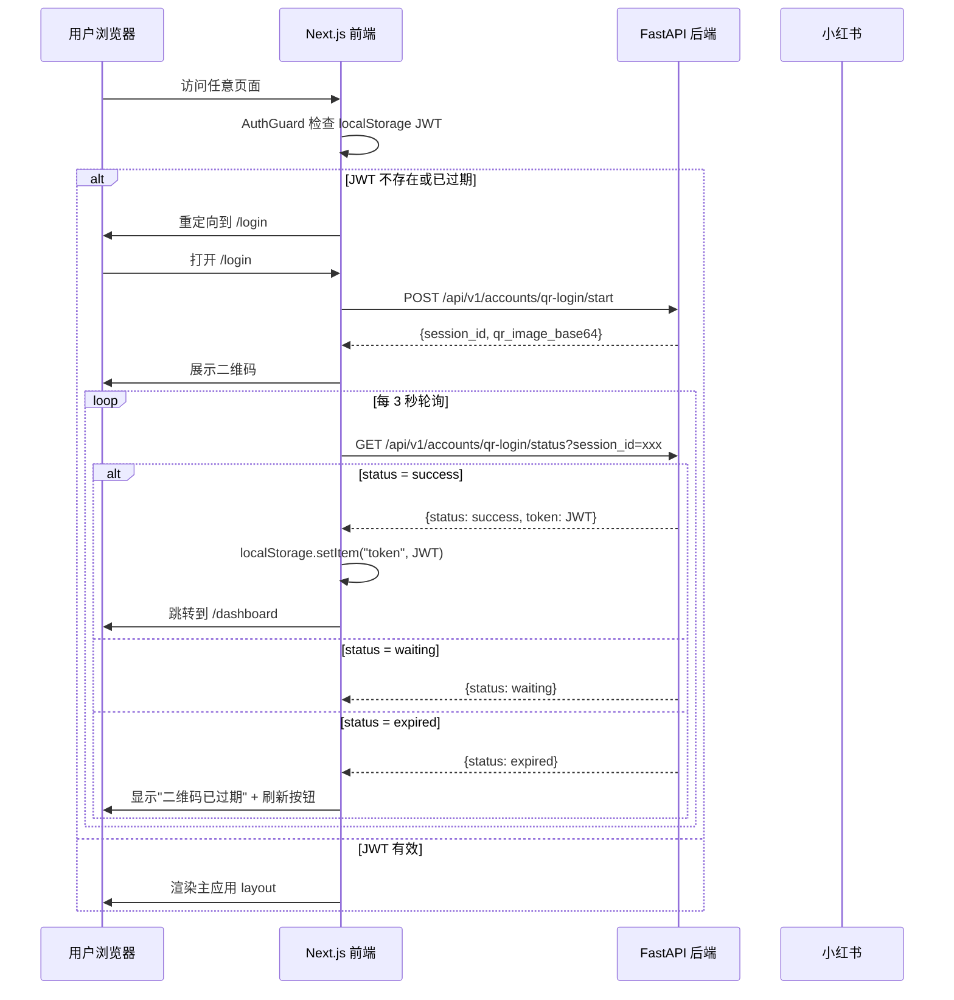

# 前端框架与扫码登录 — 设计文档

## 概述

本设计覆盖平台前端的基础框架搭建：米粉色调视觉体系、扫码登录页、登录后主布局（Sidebar + TopNav + 内容区）、认证状态管理。采用 Next.js App Router 的嵌套 layout 能力，实现登录页与主应用的布局隔离。

---

## 架构

### 页面路由与 Layout 结构

```
frontend/app/
├── layout.tsx              ← 根 layout（仅加载字体、全局样式，不含 sidebar）
├── globals.css             ← 米粉色调 theme tokens
├── login/
│   └── page.tsx            ← 扫码登录页（独立全屏，无 sidebar/topnav）
├── (dashboard)/
│   ├── layout.tsx          ← 主应用 layout（AuthGuard + Sidebar + TopNav）
│   ├── dashboard/
│   │   └── page.tsx
│   ├── accounts/
│   │   └── page.tsx
│   ├── content/
│   │   └── page.tsx
│   ├── conversations/
│   │   └── page.tsx
│   ├── hitl/
│   │   └── page.tsx
│   └── alerts/
│       └── page.tsx
└── page.tsx                ← 根路径重定向到 /dashboard
```

关键设计决策：
- 使用 Next.js Route Group `(dashboard)` 包裹所有需要认证的页面，共享带 Sidebar + TopNav 的 layout
- `/login` 在 Route Group 外部，使用根 layout，不渲染 Sidebar 和 TopNav
- 根 `layout.tsx` 只负责 `<html>`、字体加载、`globals.css`，不包含任何业务 UI

### 认证流程



---

## 组件清单

### 1. 基础设施组件

| 组件 | 文件路径 | 类型 | 职责 |
|------|---------|------|------|
| AuthProvider | `components/AuthProvider.tsx` | Client | 管理认证状态（JWT 存取、登录/登出方法），通过 React Context 向下传递 |
| AuthGuard | `components/AuthGuard.tsx` | Client | 包裹需要认证的页面，检查 JWT 有效性，无效时重定向到 /login |

### 2. 登录页组件

| 组件 | 文件路径 | 类型 | 职责 |
|------|---------|------|------|
| QrLoginCard | `components/QrLoginCard.tsx` | Client | 扫码登录卡片：品牌 Logo + 标题 + 二维码图片 + 状态提示 + 过期刷新按钮 |

### 3. 主布局组件

| 组件 | 文件路径 | 类型 | 职责 |
|------|---------|------|------|
| Sidebar | `components/Sidebar.tsx` | Client | 左侧固定导航栏：Logo + 导航项列表 + 激活态高亮 |
| TopNav | `components/TopNav.tsx` | Client | 顶部导航栏：移动端导航 + 右侧用户信息区 |
| UserMenu | `components/UserMenu.tsx` | Client | 用户头像 + 昵称 + 下拉菜单（退出登录） |

### 4. 工具模块

| 模块 | 文件路径 | 职责 |
|------|---------|------|
| api-client | `lib/api-client.ts` | 统一 HTTP 请求封装，自动注入 JWT、处理 401 拦截 |
| auth-context | `lib/auth-context.ts` | AuthContext 定义 + useAuth hook |

---

## 视觉设计

### 色彩 Token（替换现有深色方案）

| Token | 值 | 用途 |
|-------|-----|------|
| `--color-bg-primary` | `#FFF5F5` | 页面背景（极浅粉） |
| `--color-bg-surface` | `#FFFFFF` | 卡片、面板、侧边栏背景 |
| `--color-bg-surface-dim` | `#FFF0F0` | 嵌套面板、内凹区域 |
| `--color-bg-surface-hover` | `#FFE8E8` | hover 状态 |
| `--color-accent` | `#FF6B8A` | 主强调色（按钮、激活态、开关） |
| `--color-accent-secondary` | `#FF8FA3` | 次强调色（渐变终点） |
| `--color-text-primary` | `#1A1A2E` | 主文本（深色） |
| `--color-text-secondary` | `#6B7280` | 次要文本 |
| `--color-text-muted` | `rgba(26, 26, 46, 0.4)` | 占位符 |
| `--color-border` | `#F0E0E0` | 边框（浅粉灰） |
| `--color-accent-green` | `#22C55E` | 成功状态 |

### 登录页布局

```
┌─────────────────────────────────────────────┐
│          米粉渐变背景 (全屏)                  │
│                                             │
│         ┌───────────────────┐               │
│         │   ♥ RedFlow       │               │
│         │                   │               │
│         │   扫码登录         │               │
│         │                   │               │
│         │  ┌─────────────┐  │               │
│         │  │             │  │               │
│         │  │   QR Code   │  │               │
│         │  │             │  │               │
│         │  └─────────────┘  │               │
│         │                   │               │
│         │  请使用小红书App扫码│               │
│         └───────────────────┘               │
│                                             │
└─────────────────────────────────────────────┘
```

- 背景：`linear-gradient(135deg, #FFE0E6 0%, #FFF5F5 50%, #FFFFFF 100%)`
- 卡片：白色、`rounded-2xl`、`shadow-lg`、居中
- 二维码区域：200x200px、`rounded-xl`、浅灰背景（加载时）

### 主应用布局

```
┌──────────┬──────────────────────────────────┐
│          │  TopNav (64px)          [头像 ▼] │
│  Sidebar │──────────────────────────────────│
│  (240px) │                                  │
│          │  主内容区                         │
│  ♥ Logo  │  (页面路由渲染)                   │
│          │                                  │
│  导航项   │                                  │
│  · 看板   │                                  │
│  · 账号   │                                  │
│  · 内容   │                                  │
│  · 会话   │                                  │
│  · 审核   │                                  │
│  · 告警   │                                  │
│          │                                  │
└──────────┴──────────────────────────────────┘
```

---

## API 对接

### 扫码登录

| 接口 | 方法 | 路径 | 说明 |
|------|------|------|------|
| 启动扫码 | POST | `/api/v1/accounts/qr-login/start` | 返回 session_id + qr_image_base64 |
| 轮询状态 | GET | `/api/v1/accounts/qr-login/status?session_id=xxx` | 返回 waiting/success/expired |

注意：当前后端 API 需要 JWT 认证才能调用（`CurrentMerchantId` 依赖），扫码登录接口需要改为无需认证的公开接口，或新增独立的登录 API。这是一个后端改动点，需要在 tasks 中标注。

