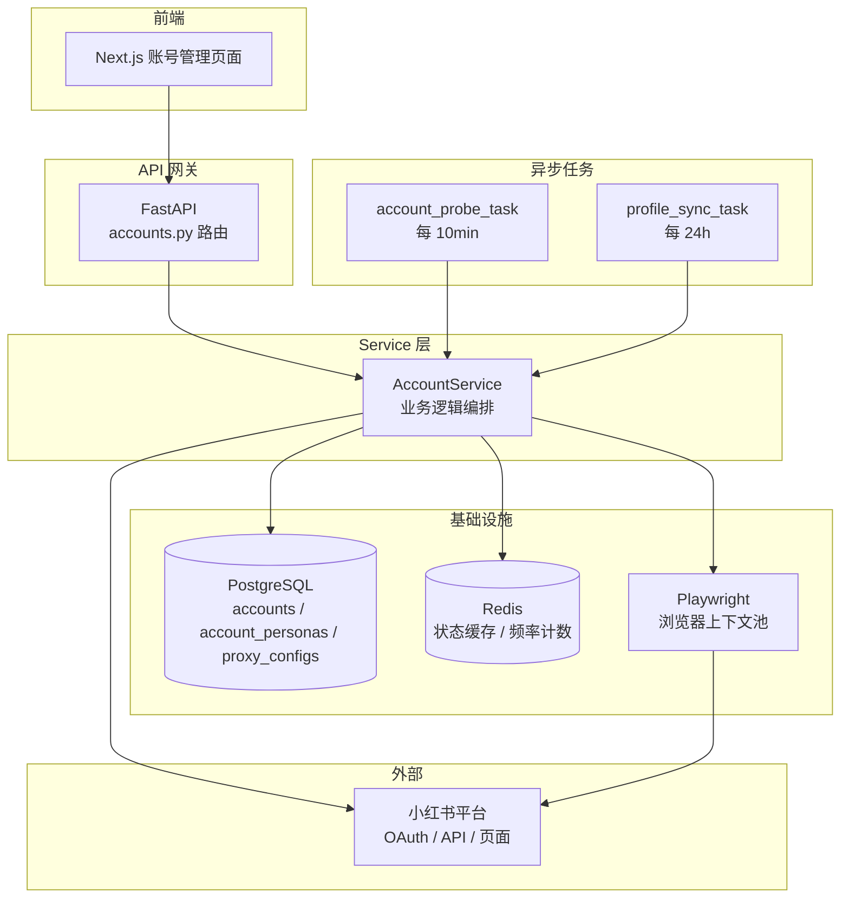
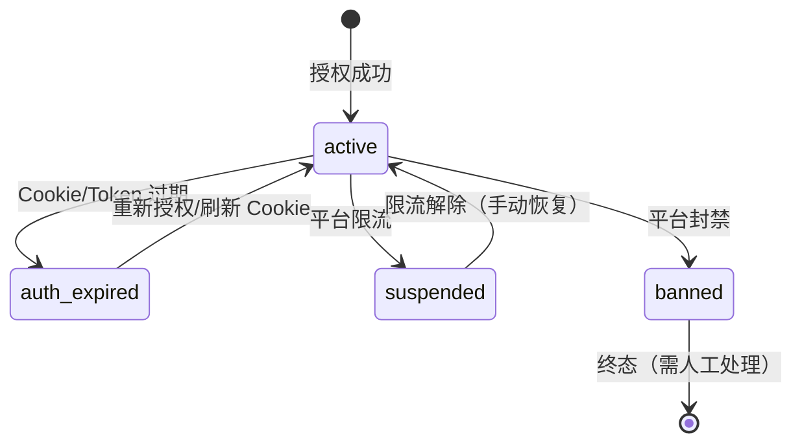
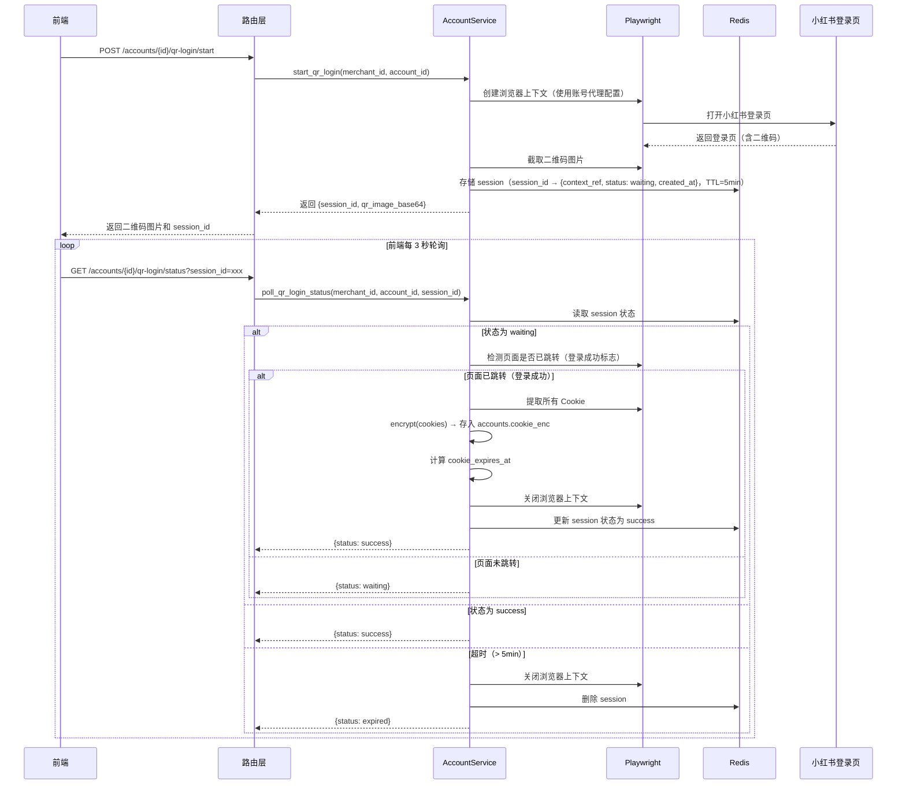
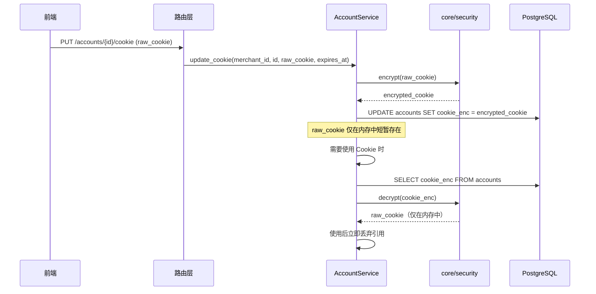

# 模块 A：账号集成与基础配置 — 设计文档

## 概述

模块 A 是整个小红书营销自动化 Agent 平台的基础层，负责解决"怎么进入小红书"的问题。所有自动化操作（内容发布、评论回复、私信发送）都依赖模块 A 提供的账号授权凭证和浏览器上下文。

本模块核心职责：
- 多种接入方式管理（OAuth 2.0、RPA、浏览器自动化）
- 敏感凭证的加密存储与生命周期管理（Token、Cookie）
- 代理 IP 与设备指纹的隔离配置
- 账号画像自动同步（昵称、简介、标签、粉丝数）
- 账号状态实时监控与告警（每 10 分钟探测）

### 设计目标

1. 安全性：所有敏感字段（`oauth_token_enc`、`cookie_enc`、`proxy_url`）加密存储，解密仅在 Service 层按需执行
2. 隔离性：每个账号拥有独立的 Playwright 浏览器上下文、代理 IP 和设备指纹，防止平台关联风控
3. 可观测性：账号状态变更全程记录日志，异常自动触发告警
4. 商家隔离：所有查询严格按 `merchant_id` 过滤

---

## 架构

### 模块 A 在系统中的位置



### 账号状态机

账号状态遵循以下状态转换规则：



状态转换规则：
- `active`：账号正常，可执行所有自动化操作
- `auth_expired`：凭证失效，暂停所有操作，等待商家刷新
- `suspended`：平台限流，暂停操作 30 分钟后可手动恢复
- `banned`：平台封禁，终态，需人工介入处理

---

## 组件与接口

### 1. API 路由层（`backend/app/api/v1/accounts.py`）

路由层只做参数校验和响应封装，所有业务逻辑委托给 `AccountService`。

| Method | Path | 说明 | 请求体 / 参数 |
|--------|------|------|---------------|
| GET | `/api/v1/accounts` | 获取商家所有账号列表 | `?limit=20&cursor=<cursor>` |
| POST | `/api/v1/accounts` | 新增账号 | `AccountCreateRequest` |
| GET | `/api/v1/accounts/{id}` | 获取账号详情 | — |
| DELETE | `/api/v1/accounts/{id}` | 删除账号 | — |
| POST | `/api/v1/accounts/{id}/oauth/callback` | OAuth 2.0 授权回调 | `OAuthCallbackRequest` |
| PUT | `/api/v1/accounts/{id}/cookie` | 更新账号 Cookie | `CookieUpdateRequest` |
| GET | `/api/v1/accounts/{id}/status` | 获取账号当前状态 | — |
| POST | `/api/v1/accounts/{id}/sync-profile` | 手动触发画像同步 | — |
| PUT | `/api/v1/accounts/{id}/persona` | 更新账号人设 | `PersonaUpdateRequest` |
| PUT | `/api/v1/accounts/{id}/proxy` | 更新代理配置 | `ProxyUpdateRequest` |
| POST | `/api/v1/accounts/{id}/qr-login/start` | 启动扫码登录，返回二维码图片 URL 和 session_id | — |
| GET | `/api/v1/accounts/{id}/qr-login/status` | 轮询扫码登录状态 | `?session_id=<session_id>` |

### 2. Service 层（`backend/app/services/account_service.py`）

`AccountService` 是模块 A 的核心业务编排器，所有业务逻辑集中在此。

```python
class AccountService:
    """账号管理业务逻辑。"""

    # ── 账号 CRUD ──
    async def list_accounts(merchant_id: str, limit: int, cursor: str | None) -> PaginatedResult
    async def create_account(merchant_id: str, data: AccountCreateRequest) -> Account
    async def get_account(merchant_id: str, account_id: UUID) -> Account
    async def delete_account(merchant_id: str, account_id: UUID) -> None

    # ── 授权管理 ──
    async def handle_oauth_callback(merchant_id: str, account_id: UUID, code: str) -> None
    async def update_cookie(merchant_id: str, account_id: UUID, raw_cookie: str, expires_at: datetime) -> None

    # ── 人设与代理 ──
    async def update_persona(merchant_id: str, account_id: UUID, data: PersonaUpdateRequest) -> None
    async def update_proxy(merchant_id: str, account_id: UUID, data: ProxyUpdateRequest) -> None

    # ── 画像同步 ──
    async def sync_profile(merchant_id: str, account_id: UUID) -> None

    # ── 状态探测 ──
    async def probe_account_status(account_id: UUID) -> AccountStatus
    async def probe_all_accounts() -> list[ProbeResult]

    # ── 浏览器上下文 ──
    async def get_browser_context(account_id: UUID) -> BrowserContext

    # ── 扫码登录 ──
    async def start_qr_login(merchant_id: str, account_id: UUID) -> QrLoginSession
    async def poll_qr_login_status(merchant_id: str, account_id: UUID, session_id: str) -> QrLoginStatus
```

关键设计决策：
- 所有方法第一个参数为 `merchant_id`，确保商家数据隔离
- 敏感字段在写入前调用 `core/security.encrypt()` 加密，读取时按需调用 `decrypt()`
- `get_browser_context()` 根据账号的 `proxy_configs` 创建隔离的 Playwright 上下文

### 3. Celery 异步任务

#### `account_probe_task`（每 10 分钟）

```
触发 → 查询所有 active 账号
     → 逐个调用 AccountService.probe_account_status()
     → 检测 Cookie 过期时间
        → 距过期 < 24h → 发送预警通知
        → 已过期 → 状态 → auth_expired，暂停操作
     → 检测平台返回状态码
        → 403/封禁码 → 状态 → banned，触发告警
        → 429/限流码 → 状态 → suspended，触发告警
     → 更新 last_probed_at
```

#### `profile_sync_task`（每 24 小时，凌晨 3 点）

```
触发 → 查询所有 active 账号
     → 逐个通过 Playwright 抓取小红书个人主页
     → 提取：昵称、简介、标签、粉丝数
     → 更新 account_personas 表
     → 更新 profile_synced_at
```

### 4. Playwright 浏览器上下文管理

每个账号拥有独立的浏览器上下文，配置项来自 `proxy_configs` 表：

```python
context = await browser.new_context(
    proxy={"server": decrypt(proxy_config.proxy_url)} if proxy_config else None,
    user_agent=proxy_config.user_agent,
    viewport=parse_resolution(proxy_config.screen_resolution),  # "1920x1080" → {"width": 1920, "height": 1080}
    timezone_id=proxy_config.timezone,
)
# 注入解密后的 Cookie
await context.add_cookies(parse_cookies(decrypt(account.cookie_enc)))
```

设计要点：
- 上下文按需创建，使用完毕后关闭，不长期持有
- 代理 URL 从数据库读取后解密，仅在内存中短暂存在
- 不同账号的 User-Agent + 分辨率 + 时区组合必须唯一（需求 A2.3）

### 5. 扫码登录流程

商家通过浏览器自动化方式接入账号时，系统提供扫码登录功能，自动完成 Cookie 提取，无需手动粘贴。



关键设计决策：
- 扫码会话通过 Redis 管理，TTL 5 分钟自动过期
- 浏览器上下文使用账号已配置的代理 IP（如有），保持 IP 一致性
- 登录成功后自动提取 Cookie 并加密存储，复用现有的 `update_cookie` 加密逻辑
- 二维码以 base64 编码返回给前端，避免额外的文件存储


---

## 数据模型

### Pydantic 请求/响应 Schema

```python
# backend/app/schemas/account.py

class AccountCreateRequest(BaseModel):
    xhs_user_id: str = Field(..., max_length=64)
    nickname: str = Field(..., max_length=128)
    access_type: Literal["oauth", "rpa", "browser"]

class OAuthCallbackRequest(BaseModel):
    code: str = Field(..., description="OAuth 授权码")

class CookieUpdateRequest(BaseModel):
    raw_cookie: str = Field(..., description="原始 Cookie 字符串")
    expires_at: datetime = Field(..., description="Cookie 过期时间")

class PersonaUpdateRequest(BaseModel):
    tone: str | None = Field(None, max_length=64)
    system_prompt: str | None = None
    bio: str | None = None
    tags: list[str] | None = None

class ProxyUpdateRequest(BaseModel):
    proxy_url: str = Field(..., description="代理地址（含认证信息）")
    user_agent: str
    screen_resolution: str = Field(..., pattern=r"^\d+x\d+$")
    timezone: str = Field(default="Asia/Shanghai")
    is_active: bool = True

class AccountResponse(BaseModel):
    id: UUID
    merchant_id: UUID
    xhs_user_id: str
    nickname: str
    access_type: str
    status: str
    cookie_expires_at: datetime | None
    last_probed_at: datetime | None
    created_at: datetime
    persona: PersonaResponse | None
    proxy: ProxyResponse | None

class PersonaResponse(BaseModel):
    tone: str | None
    bio: str | None
    tags: list[str]
    follower_count: int | None
    profile_synced_at: datetime | None

class ProxyResponse(BaseModel):
    user_agent: str
    screen_resolution: str
    timezone: str
    is_active: bool
    # 注意：proxy_url 不返回给前端，安全考虑

class AccountStatusResponse(BaseModel):
    status: str
    last_probed_at: datetime | None
    cookie_expires_at: datetime | None
    cookie_remaining_hours: float | None

class QrLoginStartResponse(BaseModel):
    session_id: str
    qr_image_base64: str  # 二维码图片 base64 编码

class QrLoginStatusResponse(BaseModel):
    status: Literal["waiting", "success", "expired"]  # waiting=等待扫码, success=登录成功, expired=超时
```

### SQLAlchemy ORM 模型

```python
# backend/app/models/account.py

class Account(Base):
    __tablename__ = "accounts"

    id: Mapped[UUID] = mapped_column(primary_key=True, default=uuid4)
    merchant_id: Mapped[UUID] = mapped_column(index=True, nullable=False)
    xhs_user_id: Mapped[str] = mapped_column(String(64), nullable=False)
    nickname: Mapped[str] = mapped_column(String(128), nullable=False)
    access_type: Mapped[str] = mapped_column(
        Enum("oauth", "rpa", "browser", name="access_type_enum"), nullable=False
    )
    oauth_token_enc: Mapped[str | None] = mapped_column(Text)
    cookie_enc: Mapped[str | None] = mapped_column(Text)
    cookie_expires_at: Mapped[datetime | None] = mapped_column(TIMESTAMPTZ)
    status: Mapped[str] = mapped_column(
        Enum("active", "suspended", "auth_expired", "banned", name="account_status_enum"),
        default="active",
    )
    last_probed_at: Mapped[datetime | None] = mapped_column(TIMESTAMPTZ)
    created_at: Mapped[datetime] = mapped_column(TIMESTAMPTZ, server_default=func.now())

    # 关系
    persona: Mapped["AccountPersona | None"] = relationship(back_populates="account", uselist=False)
    proxy_config: Mapped["ProxyConfig | None"] = relationship(back_populates="account", uselist=False)

    # 约束
    __table_args__ = (
        UniqueConstraint("merchant_id", "xhs_user_id", name="uq_merchant_xhs_user"),
    )


class AccountPersona(Base):
    __tablename__ = "account_personas"

    id: Mapped[UUID] = mapped_column(primary_key=True, default=uuid4)
    account_id: Mapped[UUID] = mapped_column(ForeignKey("accounts.id", ondelete="CASCADE"), unique=True)
    tone: Mapped[str | None] = mapped_column(String(64))
    system_prompt: Mapped[str | None] = mapped_column(Text)
    bio: Mapped[str | None] = mapped_column(Text)
    tags: Mapped[list[str]] = mapped_column(ARRAY(Text), default=list)
    follower_count: Mapped[int | None] = mapped_column(Integer)
    profile_synced_at: Mapped[datetime | None] = mapped_column(TIMESTAMPTZ)

    account: Mapped["Account"] = relationship(back_populates="persona")


class ProxyConfig(Base):
    __tablename__ = "proxy_configs"

    id: Mapped[UUID] = mapped_column(primary_key=True, default=uuid4)
    account_id: Mapped[UUID] = mapped_column(ForeignKey("accounts.id", ondelete="CASCADE"), unique=True)
    proxy_url: Mapped[str] = mapped_column(Text, nullable=False)  # 加密存储
    user_agent: Mapped[str] = mapped_column(Text, nullable=False)
    screen_resolution: Mapped[str] = mapped_column(String(16), nullable=False)
    timezone: Mapped[str] = mapped_column(String(64), default="Asia/Shanghai")
    is_active: Mapped[bool] = mapped_column(Boolean, default=True)

    account: Mapped["Account"] = relationship(back_populates="proxy_config")
```

### 数据库约束与索引

| 表 | 约束/索引 | 说明 |
|------|-----------|------|
| accounts | `UNIQUE(merchant_id, xhs_user_id)` | 同一商家下小红书用户 ID 不重复 |
| accounts | `INDEX(merchant_id)` | 按商家查询加速 |
| accounts | `INDEX(status)` | 按状态筛选（探测任务用） |
| account_personas | `UNIQUE(account_id)` | 一对一关系 |
| proxy_configs | `UNIQUE(account_id)` | 一对一关系 |

### 加密字段处理流程


