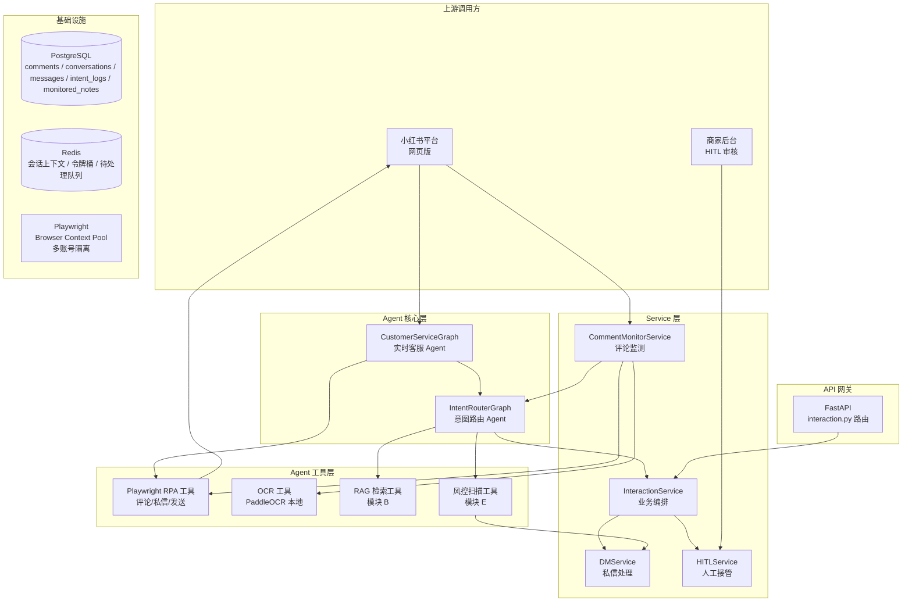
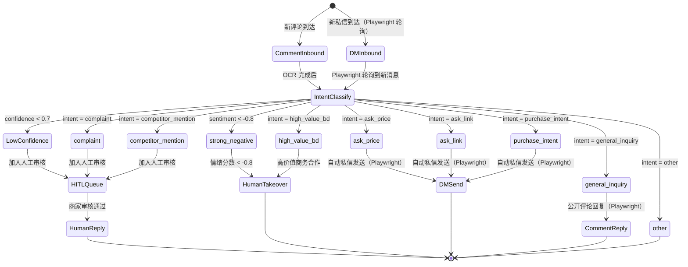
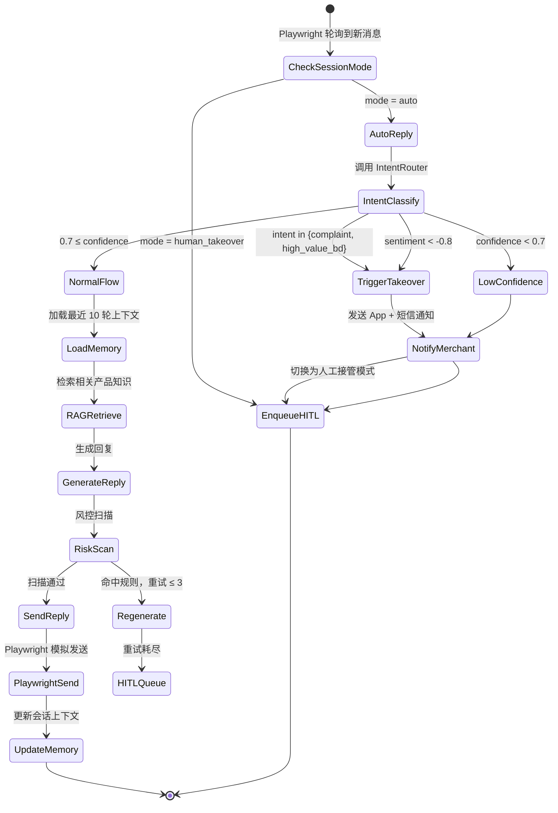
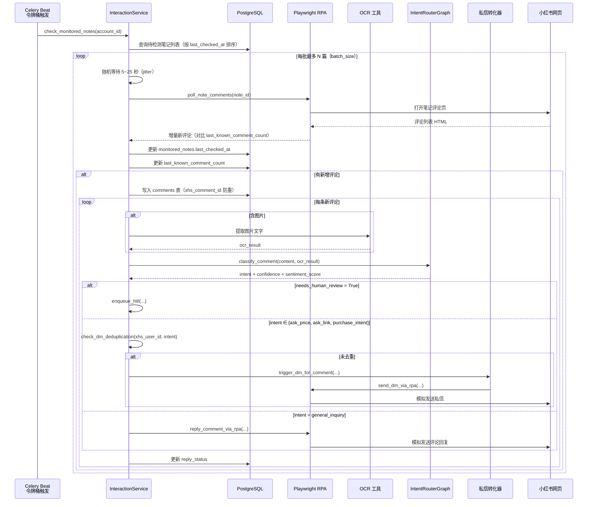
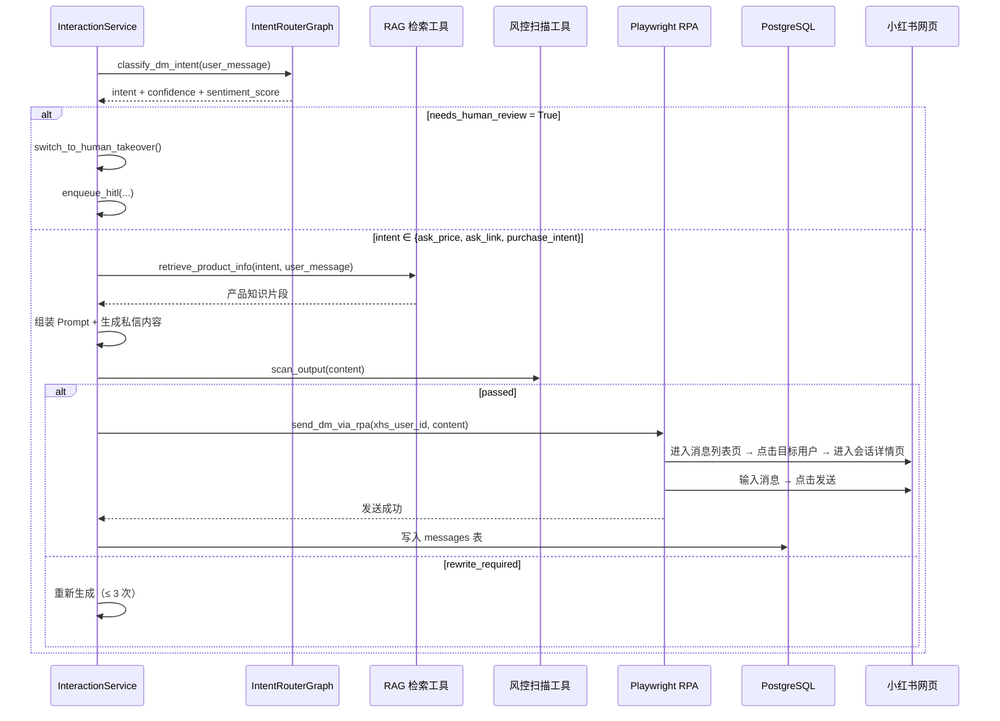
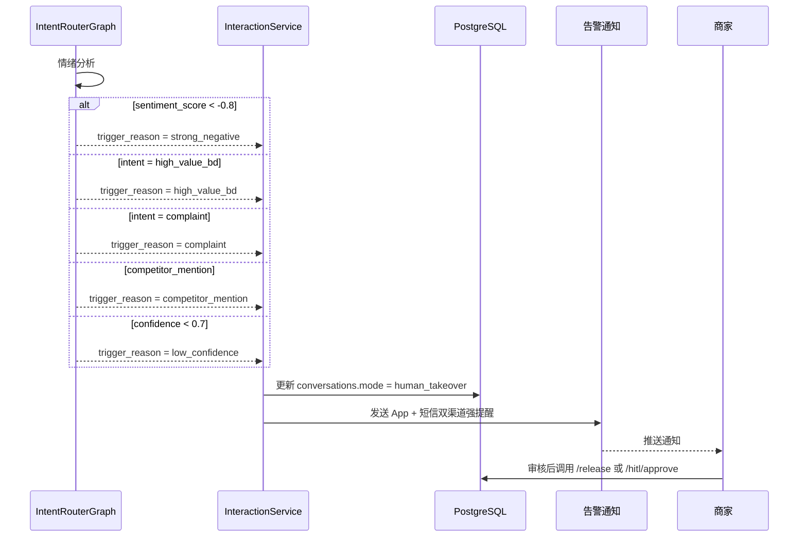

# 模块 D：互动与意图路由 — 设计文档

> **技术选型说明**：由于小红书开放平台 API 需要企业资质，本模块所有与小红书平台的交互均采用 **Playwright RPA（浏览器自动化）** 方案实现，不依赖官方 API 接口。

## 概述

模块 D 是小红书营销自动化 Agent 的核心大脑，负责监听用户互动、理解用户意图并触发相应的自动化响应。模块 D 通过统一的意图识别路由将评论和私信分发到不同的处理链路，同时维护会话上下文和用户记忆，为商家提供实时客服能力和人工接管机制。

本模块核心职责：
- **评论实时监测**：持续监控商家指定的笔记评论区，通过 OCR 识别图片评论中的文字，检测重复意图避免骚扰
- **多层级意图识别**：通过 Function Calling 对评论和私信进行意图分类和情绪分析，输出结构化结果
- **自动化私信触发**：根据意图类型自动触发私信回复，支持问价、问链接、购买意向等场景
- **人工接管机制**：在高风险（强愤怒情绪）或高价值（商务合作）场景下自动通知商家并暂停自动回复
- **实时客服**：通过 Playwright RPA 轮询商家端消息页面，实时生成回复，维持多轮对话上下文

### 设计目标

1. **实时性（努力目标）**：评论监测延迟 ≤ 60 秒；实时客服端到端延迟目标 ≤ 5 秒（业务可接受偶发超出，主要目标是避免被平台检测为自动化脚本）
2. **准确性**：意图分类置信度阈值 0.7，低于阈值或特定意图自动触发人工审核
3. **去重保护**：同一用户 24 小时内相同意图评论仅触发一次私信，避免骚扰
4. **上下文连贯**：多轮对话保留最近 10 轮消息记录，确保回复内容连贯
5. **可干预**：商家可随时切换人工接管，实时查看活跃会话状态
6. **防检测**：全链路反爬虫措施，降低被小红书识别为自动化脚本的风险

---

## 架构

### 模块 D 在系统中的位置



### RPA 交互模式说明

所有与小红书平台的交互（评论监测、私信接收、私信发送、评论回复）均通过 Playwright RPA 完成：

- **评论监测**：使用 Playwright 轮询商家指定笔记的评论列表页
- **私信接收**：使用 Playwright 轮询商家端消息页面
- **私信发送**：Playwright 模拟人工操作，在消息页面输入并发送
- **评论回复**：Playwright 模拟人工操作，在评论输入框输入并提交

每个账号使用独立的 Playwright Browser Context，包含该账号的 `cookie`（从模块 A 获取）、`user_agent`、`viewport`、`timezone`、`proxy`（来自 `ProxyConfig`），确保设备指纹一致性。

**运行模式**：所有 Playwright RPA 操作默认以 `headless=True`（无头模式）运行，浏览器在后台静默执行，商家无法看到操作过程。这样可以 24/7 无人值守运行，不影响服务器资源。

商家如需调试，可通过商家后台的"调试视图"临时开启 `headless=False`（有头模式）查看浏览器操作过程。

### 意图分类状态机



### 实时客服 Agent 状态机（D5）



---

## 组件与接口

### 1. ORM 数据模型（`backend/app/models/interaction.py`）

#### Comment（评论记录）

| 字段 | 类型 | 说明 |
|------|------|------|
| id | UUID PK | 评论唯一标识 |
| merchant_id | UUID FK, indexed | 所属商家 |
| account_id | UUID FK | 被评论的账号 |
| xhs_note_id | VARCHAR(64) | 所属笔记 ID |
| xhs_comment_id | VARCHAR(64) UNIQUE | 小红书平台评论 ID（防重） |
| xhs_user_id | VARCHAR(64) | 评论用户 ID |
| content | TEXT | 评论文本内容 |
| image_urls | TEXT[] | 评论图片 URL 数组 |
| ocr_result | TEXT | OCR 提取文字（图片评论时） |
| intent | VARCHAR(32) | 意图分类结果 |
| intent_confidence | FLOAT | 意图置信度 |
| sentiment_score | FLOAT | 情绪分数（-1.0 ~ 1.0） |
| reply_status | ENUM('pending','replied','manual_review','skipped') | 回复状态 |
| deduplicated | BOOLEAN | 是否已去重（24h 同意图已触发过） |
| detected_at | TIMESTAMPTZ | 检测到评论的时间 |
| created_at | TIMESTAMPTZ | 创建时间 |

#### Conversation（私信会话）

| 字段 | 类型 | 说明 |
|------|------|------|
| id | UUID PK | 会话唯一标识 |
| merchant_id | UUID FK, indexed | 所属商家 |
| account_id | UUID FK | 商家账号 |
| xhs_user_id | VARCHAR(64) | 对话用户 ID |
| mode | ENUM('auto','human_takeover','pending') | 会话模式 |
| user_long_term_memory | JSONB | 用户长期记忆（偏好标签、历史意向） |
| online_hours_start | TIME | 在线时段开始（nullable） |
| online_hours_end | TIME | 在线时段结束（nullable） |
| last_message_at | TIMESTAMPTZ | 最近消息时间 |
| created_at | TIMESTAMPTZ | 会话创建时间 |

#### Message（消息记录）

| 字段 | 类型 | 说明 |
|------|------|------|
| id | UUID PK | 消息唯一标识 |
| xhs_msg_id | VARCHAR(64), UNIQUE | 小红书平台消息 ID（防重） |
| conversation_id | UUID FK, indexed | 所属会话 |
| role | ENUM('user','assistant') | 消息角色 |
| content | TEXT | 消息内容 |
| intent | VARCHAR(32) | 意图分类（仅 user 消息） |
| intent_confidence | FLOAT | 意图置信度 |
| sentiment_score | FLOAT | 情绪分数 |
| sent_at | TIMESTAMPTZ | 发送时间 |

#### IntentLog（意图识别日志）

| 字段 | 类型 | 说明 |
|------|------|------|
| id | UUID PK | 日志唯一标识 |
| merchant_id | UUID FK, indexed | 所属商家 |
| source_type | ENUM('comment','message') | 来源类型 |
| source_id | UUID | 来源记录 ID（comment_id / conversation_id） |
| raw_input | TEXT | 原始输入文本 |
| intent | VARCHAR(32) | 识别结果 |
| confidence | FLOAT | 置信度 |
| sentiment_score | FLOAT | 情绪分数 |
| llm_latency_ms | INT | LLM 调用耗时（毫秒） |
| created_at | TIMESTAMPTZ | 记录时间 |

#### HITLQueue（HITL 待审核队列）

| 字段 | 类型 | 说明 |
|------|------|------|
| id | UUID PK | 队列项唯一标识 |
| merchant_id | UUID FK, indexed | 所属商家 |
| conversation_id | UUID FK, nullable | 关联会话（私信时） |
| comment_id | UUID FK, nullable | 关联评论（评论时） |
| trigger_reason | VARCHAR(64) | 触发原因（low_confidence/complaint/competitor/high_value_bd/strong_negative/captcha_detected） |
| original_content | TEXT | 原始用户输入 |
| suggested_reply | TEXT | AI 建议回复（nullable） |
| final_reply | TEXT | 最终回复（审核通过后填入） |
| status | ENUM('pending','approved','rejected','edited') | 审核状态 |
| reviewed_by | UUID, nullable | 审核人 |
| reviewed_at | TIMESTAMPTZ, nullable | 审核时间 |
| created_at | TIMESTAMPTZ | 入队时间 |

#### DMTriggerLog（私信触发去重日志）

| 字段 | 类型 | 说明 |
|------|------|------|
| id | UUID PK | 日志唯一标识 |
| merchant_id | UUID FK, indexed | 所属商家 |
| account_id | UUID FK | 商家账号 |
| xhs_user_id | VARCHAR(64) | 用户 ID |
| xhs_comment_id | VARCHAR(64) | 对应评论 ID |
| intent | VARCHAR(32) | 触发意图 |
| triggered_at | TIMESTAMPTZ | 触发时间 |
| expires_at | TIMESTAMPTZ | 过期时间（+24h） |

#### MonitoredNote（监测笔记配置）

| 字段 | 类型 | 说明 |
|------|------|------|
| id | UUID PK | 配置唯一标识 |
| merchant_id | UUID FK, indexed | 所属商家 |
| account_id | UUID FK | 所属账号 |
| xhs_note_id | VARCHAR(64) | 笔记 ID |
| note_title | VARCHAR(256) | 笔记标题（缓存） |
| is_active | BOOLEAN | 是否启用监测 |
| check_interval_seconds | INT | 检查间隔（秒），默认 60 |
| batch_size | INT | 每次检查最多处理笔记数，默认 3 |
| last_checked_at | TIMESTAMPTZ | 最近检查时间 |
| last_known_comment_count | INT | 最近已知评论数（用于增量检测） |
| created_at | TIMESTAMPTZ | 创建时间 |

**约束**：`UNIQUE(account_id, xhs_note_id)` — 同一账号下同一笔记不重复添加。

### 2. Pydantic Schema（`backend/app/schemas/interaction.py`）

#### 评论相关

```python
class MonitoredNoteCreateRequest(BaseModel):
    account_id: UUID
    xhs_note_id: str = Field(..., max_length=64)
    note_title: str = Field(..., max_length=256)
    check_interval_seconds: int = Field(default=60, ge=30, le=300)
    batch_size: int = Field(default=3, ge=1, le=10)

class MonitoredNoteUpdateRequest(BaseModel):
    is_active: bool | None = None
    check_interval_seconds: int | None = Field(None, ge=30, le=300)
    batch_size: int | None = Field(None, ge=1, le=10)

class MonitoredNoteListRequest(BaseModel):
    account_id: UUID | None = None
    is_active: bool | None = None

class CommentIntentRequest(BaseModel):
    comment_id: UUID

class CommentIntentResponse(BaseModel):
    comment_id: UUID
    intent: Literal["ask_price", "complaint", "ask_link", "general_inquiry", "competitor_mention", "other"]
    confidence: float = Field(..., ge=0.0, le=1.0)
    sentiment_score: float = Field(..., ge=-1.0, le=1.0)
    ocr_result: str | None = None
    needs_human_review: bool

class CommentReplyRequest(BaseModel):
    comment_id: UUID
    reply_content: str = Field(..., min_length=15, max_length=80)
    force: bool = False  # 跳过风控，仅人工审核后使用

class CommentListRequest(BaseModel):
    account_id: UUID | None = None
    xhs_note_id: str | None = None
    reply_status: Literal["pending", "replied", "manual_review", "skipped"] | None = None
    intent: str | None = None
    start_date: datetime | None = None
    end_date: datetime | None = None
    limit: int = Field(default=20, le=100)
    cursor: str | None = None
```

#### 私信会话相关

```python
class DMIntentRequest(BaseModel):
    conversation_id: UUID

class DMReplyRequest(BaseModel):
    conversation_id: UUID
    message_content: str = Field(..., min_length=1, max_length=500)
    force: bool = False

class ConversationModeRequest(BaseModel):
    mode: Literal["auto", "human_takeover"]

class ConversationListRequest(BaseModel):
    account_id: UUID | None = None
    mode: Literal["auto", "human_takeover", "pending"] | None = None
    limit: int = Field(default=20, le=100)
    cursor: str | None = None

class MessageListRequest(BaseModel):
    conversation_id: UUID
    limit: int = Field(default=20, le=100)
    cursor: str | None = None
```

#### HITL 审核相关

```python
class HITLApproveRequest(BaseModel):
    queue_id: UUID
    final_reply: str | None = None  # 若为空则使用 AI 建议回复

class HITLEditApproveRequest(BaseModel):
    queue_id: UUID
    edited_reply: str

class HITLRejectRequest(BaseModel):
    queue_id: UUID
    reason: str | None = None

class HITLBatchApproveRequest(BaseModel):
    queue_ids: list[UUID] = Field(..., min_length=1, max_length=20)

class HITLQueueItemResponse(BaseModel):
    id: UUID
    trigger_reason: str
    original_content: str
    suggested_reply: str | None
    conversation_id: UUID | None
    comment_id: UUID | None
    status: str
    created_at: datetime
```

### 3. Service 层（`backend/app/services/interaction_service.py`）

```python
class InteractionService:
    """互动路由与实时客服服务。"""

    # ── 笔记监测配置 ──
    async def add_monitored_note(
        merchant_id: UUID,
        data: MonitoredNoteCreateRequest,
        db: AsyncSession,
    ) -> MonitoredNote:
        """商家添加需要监测的笔记。"""

    async def remove_monitored_note(
        merchant_id: UUID,
        note_id: UUID,
        db: AsyncSession,
    ) -> None:
        """商家移除监测笔记。"""

    async def list_monitored_notes(
        merchant_id: UUID,
        account_id: UUID | None,
        is_active: bool | None,
        db: AsyncSession,
    ) -> list[MonitoredNote]:
        """获取监测笔记列表。"""

    # ── 评论监测 ──
    async def check_monitored_notes(
        account_id: UUID,
        db: AsyncSession,
    ) -> list[Comment]:
        """检查账号下所有待检测笔记的新评论。使用令牌桶 + 随机抖动控制频率。"""

    async def process_single_note_comments(
        merchant_id: UUID,
        note_id: UUID,
        db: AsyncSession,
    ) -> list[Comment]:
        """检查单个笔记的新评论。通过 Playwright RPA 获取评论列表，比对本地缓存增量。"""

    async def process_comment_intent(
        merchant_id: UUID,
        comment_id: UUID,
        db: AsyncSession,
    ) -> IntentClassificationResult:
        """对评论执行 OCR（若含图片）并调用 IntentRouter 进行意图分类。"""

    async def check_dm_deduplication(
        merchant_id: UUID,
        account_id: UUID,
        xhs_user_id: str,
        xhs_comment_id: str,
        intent: str,
        db: AsyncSession,
    ) -> bool:
        """检查 24h 内是否存在相同意图的已触发记录。返回 True 表示去重（不触发）。"""

    # ── 意图分类 ──
    async def classify_comment_intent(
        merchant_id: UUID,
        content: str,
        account_id: UUID,
        db: AsyncSession,
    ) -> IntentClassificationResult:
        """调用 IntentRouter Agent 对评论进行意图分类。"""

    async def classify_dm_intent(
        merchant_id: UUID,
        conversation_id: UUID,
        content: str,
        db: AsyncSession,
    ) -> IntentClassificationResult:
        """调用 IntentRouter Agent 对私信进行意图分类。"""

    # ── 私信处理 ──
    async def trigger_dm_for_comment(
        merchant_id: UUID,
        comment_id: UUID,
        intent: str,
        db: AsyncSession,
    ) -> str:
        """根据评论意图触发私信发送。返回发送的内容。"""

    async def trigger_dm_for_conversation(
        merchant_id: UUID,
        conversation_id: UUID,
        intent: str,
        user_message: str,
        db: AsyncSession,
    ) -> str:
        """根据私信意图触发自动回复。返回发送的内容。"""

    async def send_dm_via_rpa(
        merchant_id: UUID,
        account_id: UUID,
        xhs_user_id: str,
        content: str,
        db: AsyncSession,
    ) -> bool:
        """通过 Playwright RPA 发送私信。内部调用 humanized_delay 和风控扫描。"""

    async def reply_comment_via_rpa(
        merchant_id: UUID,
        account_id: UUID,
        xhs_note_id: str,
        xhs_comment_id: str,
        reply_content: str,
        db: AsyncSession,
    ) -> bool:
        """通过 Playwright RPA 发送评论回复。回复字数 15~80 汉字。"""

    # ── 会话管理 ──
    async def get_or_create_conversation(
        merchant_id: UUID,
        account_id: UUID,
        xhs_user_id: str,
        db: AsyncSession,
    ) -> Conversation:
        """获取或创建私信会话。"""

    async def get_conversation_mode(
        conversation_id: UUID,
        db: AsyncSession,
    ) -> Literal["auto", "human_takeover"]:
        """获取当前会话模式。"""

    async def switch_to_human_takeover(
        merchant_id: UUID,
        conversation_id: UUID,
        reason: str,
        db: AsyncSession,
    ) -> None:
        """切换会话为人工接管模式，发送告警通知。"""

    async def release_human_takeover(
        merchant_id: UUID,
        conversation_id: UUID,
        db: AsyncSession,
    ) -> None:
        """解除人工接管，恢复自动模式。"""

    # ── 上下文与记忆 ──
    async def get_recent_messages(
        conversation_id: UUID,
        limit: int = 10,
        db: AsyncSession,
    ) -> list[Message]:
        """获取最近 N 轮对话上下文。"""

    async def append_message(
        conversation_id: UUID,
        role: Literal["user", "assistant"],
        content: str,
        intent: str | None = None,
        confidence: float | None = None,
        sentiment_score: float | None = None,
        db: AsyncSession,
    ) -> Message:
        """向会话追加消息。自动截断超过 10 轮的旧消息。"""

    # ── HITL ──
    async def enqueue_hitl(
        merchant_id: UUID,
        conversation_id: UUID | None,
        comment_id: UUID | None,
        trigger_reason: str,
        original_content: str,
        suggested_reply: str | None,
        db: AsyncSession,
    ) -> HITLQueue:
        """将条目加入 HITL 待审核队列。"""

    async def approve_hitl(
        merchant_id: UUID,
        queue_id: UUID,
        final_reply: str | None,
        reviewer_id: UUID,
        db: AsyncSession,
    ) -> None:
        """审核通过：发送回复并更新队列状态。"""

    async def reject_hitl(
        merchant_id: UUID,
        queue_id: UUID,
        reviewer_id: UUID,
        reason: str | None,
        db: AsyncSession,
    ) -> None:
        """审核拒绝：记录拒绝原因并更新队列状态。"""

    # ── 在线时段 ──
    async def is_within_online_hours(
        account_id: UUID,
        db: AsyncSession,
    ) -> bool:
        """检查当前时间是否在账号配置的在线时段内。"""

    # ── Playwright RPA 轮询 ──
    async def poll_dm_messages(
        account_id: UUID,
        db: AsyncSession,
    ) -> list[Message]:
        """通过 Playwright RPA 轮询商家端消息页面，检测新私信并写入 messages 表。"""

    async def poll_note_comments(
        account_id: UUID,
        note_id: UUID,
        db: AsyncSession,
    ) -> list[Comment]:
        """通过 Playwright RPA 轮询指定笔记的评论列表，增量检测新评论。"""

    # ── Captcha 检测 ──
    async def handle_captcha_detected(
        account_id: UUID,
        trigger_reason: str,
        db: AsyncSession,
    ) -> None:
        """Captcha 检测触发时，暂停账号自动化操作，加入 HITL 队列，发送告警。"""
```

#### IntentClassificationResult 内部结构

```python
class IntentClassificationResult:
    intent: str
    confidence: float
    sentiment_score: float
    needs_human_review: bool
    review_reason: str | None
```

### 4. API 路由层（`backend/app/api/v1/interaction.py`）

| Method | Path | 说明 | 备注 |
|--------|------|------|------|
| GET | `/api/v1/interaction/monitored-notes` | 获取监测笔记列表 | 支持账号/状态筛选 |
| POST | `/api/v1/interaction/monitored-notes` | 添加监测笔记 | 商家配置 |
| PUT | `/api/v1/interaction/monitored-notes/{id}` | 更新监测配置 | 间隔/批次大小 |
| DELETE | `/api/v1/interaction/monitored-notes/{id}` | 移除监测笔记 |  |
| GET | `/api/v1/interaction/comments` | 获取评论列表 | 分页、状态筛选 |
| GET | `/api/v1/interaction/comments/{id}` | 获取评论详情 | 含 OCR 结果 |
| POST | `/api/v1/interaction/comments/{id}/classify` | 手动触发评论意图分类 |  |
| POST | `/api/v1/interaction/comments/{id}/reply` | 发送评论回复 | Playwright RPA |
| GET | `/api/v1/interaction/conversations` | 获取私信会话列表 | 分页、模式筛选 |
| GET | `/api/v1/interaction/conversations/{id}` | 获取会话详情 | 含模式状态 |
| GET | `/api/v1/interaction/conversations/{id}/messages` | 获取会话消息记录 | 分页 |
| POST | `/api/v1/interaction/conversations/{id}/reply` | 发送私信回复 | Playwright RPA |
| POST | `/api/v1/interaction/conversations/{id}/takeover` | 切换人工接管 |  |
| POST | `/api/v1/interaction/conversations/{id}/release` | 解除人工接管 |  |
| POST | `/api/v1/interaction/conversations/{id}/poll` | 手动触发私信轮询 | 调试用 |
| PUT | `/api/v1/interaction/conversations/{id}/online-hours` | 配置在线时段 |  |
| GET | `/api/v1/interaction/hitl/queue` | 获取 HITL 待审核队列 | 分页 |
| POST | `/api/v1/interaction/hitl/{id}/approve` | 审核通过 |  |
| POST | `/api/v1/interaction/hitl/{id}/edit-approve` | 修改后通过 |  |
| POST | `/api/v1/interaction/hitl/{id}/reject` | 拒绝回复 |  |
| POST | `/api/v1/interaction/hitl/batch-approve` | 批量审核通过 | 最多 20 条 |

---

## 关键流程

### 流程 1：评论监测与意图分类（D1）



### 流程 2：私信触发链路（D3）

> **注**：小红书网页私信需要在会话详情页操作，无法在消息列表页直接发送。



### 流程 3：人工接管触发（D4）



### 流程 4：实时客服端到端（D5，延迟 ≤ 5s）

```mermaid
sequenceDiagram
    participant CB as Celery Beat<br/>私信轮询触发
    participant IS as InteractionService
    participant RPA as Playwright RPA
    participant DB as PostgreSQL
    participant MEM as 记忆模块
    participant IR as IntentRouterGraph
    participant RAG as RAG 检索工具
    participant RS as 风控扫描工具
    participant XHS as 小红书网页
    participant NT as 告警通知
    participant MERCHANT as 商家

    CB->>IS: poll_dm_messages(account_id)
    IS->>RPA: 打开商家端消息页面
    RPA->>XHS: 获取消息列表
    XHS-->>RPA: 消息列表 HTML
    RPA-->>IS: 新消息列表

    loop 每条新消息
        IS->>DB: 防重检查（msg_id），写入 messages 表
        IS->>DB: 查询 conversations.mode

        alt mode = human_takeover
            IS->>IS: enqueue_hitl(...)
        end

        alt 在线时段外
            IS->>RPA: 发送"稍后为您解答，稍后人工处理"
            RPA->>XHS: 模拟发送延迟通知
        end

        IS->>IR: classify_dm_intent(content)
        IR-->>IS: intent + confidence + sentiment_score (< 3s)

        alt needs_human_review = True
            IS->>IS: switch_to_human_takeover()
            IS->>NT: App + 短信强提醒
            NT-->>MERCHANT
            IS->>IS: enqueue_hitl(...)
        end

        IS->>MEM: get_recent_messages(limit=10)
        IS->>RAG: retrieve(intent, content)
        IS->>IS: 组装 Prompt + 生成回复
        IS->>RS: scan_output(content)

        alt passed
            IS->>RPA: send_dm_via_rpa(reply_content)
            RPA->>XHS: 模拟发送私信
            IS->>MEM: update_context(new_message)
            IS->>DB: 更新 last_message_at
        end
    end
```

**关键时序约束**：
- 私信轮询触发 → 意图分类完成：< 3 秒
- 私信轮询触发 → 回复发送完成：< 5 秒
- 每次操作间隔随机等待：3~15 秒（humanized delay）
- Captcha 检测 → 账号自动化暂停 → 告警通知：< 10 秒

---

## RPA 防检测设计

> 核心原则：所有 Playwright RPA 操作必须模拟真实用户行为，避免规律性请求和可被平台识别的自动化特征。

### 1. Humanized Timing（行为随机化）

每次触发 Playwright 操作前，注入随机延迟：

```python
import random

def humanized_delay(min_seconds: float = 3.0, max_seconds: float = 15.0) -> float:
    """返回随机等待秒数，模拟人类操作间隔。"""
    return random.uniform(min_seconds, max_seconds)
```

规则：
- **每次操作前**：随机等待 3~15 秒
- **页面间跳转**：随机等待 1~5 秒（模拟阅读时间）
- **评论发送后**：随机等待 5~20 秒再执行下一个动作

### 2. 令牌桶 + 随机抖动（评论监测）

评论监测不采用固定间隔轮询，而是令牌桶控制：

```python
class NotePollingScheduler:
    """笔记监测调度器。令牌桶 + 随机抖动。"""

    def __init__(self, batch_size: int = 3, base_interval: int = 30):
        self.batch_size = batch_size  # 每批处理笔记数
        self.base_interval = base_interval  # 基础间隔（秒）

    def get_jitter_delay(self) -> float:
        """随机抖动：在基础间隔上加入 ±50% 随机偏移。"""
        jitter = self.base_interval * 0.5
        return self.base_interval + random.uniform(-jitter, jitter)

    def get_batch_start_delay(self) -> float:
        """批次开始前随机等待 5~25 秒。"""
        return random.uniform(5, 25)
```

每批笔记检查流程：
1. 从待检测笔记中取最多 `batch_size` 篇
2. 随机等待 5~25 秒（jitter）
3. 按笔记顺序依次处理，每篇之间随机等待 3~15 秒
4. 批次完成后按 `check_interval_seconds` 计算下次触发时间

### 3. 设备指纹一致性

每个账号的 Playwright Browser Context 必须使用该账号在 `ProxyConfig` 中配置的设备参数：

| 参数 | 来源 | 要求 |
|------|------|------|
| Cookie | 模块 A 管理的 `accounts.cookie_enc` | 解密后注入 Context |
| User-Agent | `ProxyConfig.user_agent` | 必须与配置一致 |
| Viewport | `ProxyConfig.screen_resolution` | 如 1920x1080 |
| Timezone | `ProxyConfig.timezone` | 如 Asia/Shanghai |
| Proxy URL | `ProxyConfig.proxy_url_enc` | 解密后使用 |

同一账号所有操作复用同一个 Browser Context，避免 Context 切换导致指纹变化。

### 4. Captcha 检测与应对

#### 什么是 Captcha

Captcha（验证码）是平台用于区分人类用户和自动化程序的挑战机制。当小红书怀疑某操作为机器人时触发。

常见类型：

| 类型 | 表现 | 自动化难度 |
|------|------|----------|
| 滑动验证码 | 将拼图滑到正确位置 | 中等 |
| 点选验证码 | 按顺序点击指定文字/图案 | 较难 |
| 图形验证码 | 输入显示的字符 | 较容易，OCR 可尝试 |
| 行为验证码 | 滑动成功率低后出现二次验证 | 难 |

#### 触发场景

- 短时间内操作频率异常（评论、私信过多）
- 多账号从同一 IP 发出请求
- 操作行为模式过于规律
- 异地登录（Cookie 和 IP 不匹配）
- 新账号（权重低，更容易被怀疑）

#### 检测逻辑

每次 Playwright 操作后，检测页面是否出现验证码元素：

```python
async def check_captcha(page: Page) -> bool:
    """检测页面是否出现小红书验证码。"""
    captcha_selectors = [
        ".captcha-modal",
        "#captcha-container",
        ".xhs-captcha",
        ".geetest_panel",           # 极验
        ".dun-validate-container",  # 网易盾
    ]
    for selector in captcha_selectors:
        if await page.is_visible(selector, timeout=2000):
            return True
    return False
```

#### 触发后的处理流程

1. Captcha 检测到 → 立即停止该账号所有自动化操作
2. 设置 Redis `rpa:captcha_flag:{account_id}` 阻断标记
3. 调用 `enqueue_hitl(trigger_reason='captcha_detected')` 写入 HITL 队列
4. 发送告警通知（App + 短信）给商家
5. **商家人工处理验证码**：商家在小红书 App/网页完成验证码挑战后，点击"已处理"按钮，系统清除 Redis 阻断标记，自动恢复该账号的 RPA 操作

**注意**：不设计自动破解方案（破解成功率低且有封号风险）。完全依赖人工处理。

### 5. Cookie 过期感知

模块 A 会周期性检测 Cookie 有效期（`cookie_expires_at`）。当发现 Cookie 即将过期（< 24 小时）或已过期时：

1. 更新 `accounts.status = auth_expired`
2. 停止该账号所有 RPA 自动化
3. 发送告警通知商家刷新 Cookie

Module D 在执行 RPA 操作前，应检查账号状态，拒绝向已过期账号执行操作。

### 6. 操作频率硬性上限

遵守模块 E 的频率限制，不因 RPA 而超出：

- 评论回复：≤ 20 次/小时/账号
- 私信发送：≤ 50 次/小时/账号

每次发送前调用 `RiskService.check_and_reserve_quota()`，超限账号自动暂停自动化。

### 7. 页面滚动与点击随机化

在 Playwright 操作中模拟人类行为：

```python
async def human_scroll(page: Page):
    """模拟人类滚动页面：非一次性滚到底，而是分步滚动。"""
    for _ in range(random.randint(2, 4)):
        await page.mouse.wheel(0, random.randint(200, 500))
        await asyncio.sleep(random.uniform(0.5, 1.5))

async def human_click(page: Page, selector: str):
    """模拟人类点击：先悬停，再点击，带随机偏移。"""
    await page.hover(selector)
    await asyncio.sleep(random.uniform(0.3, 0.8))
    box = await page.locator(selector).bounding_box()
    if box:
        offset_x = random.uniform(-3, 3)
        offset_y = random.uniform(-3, 3)
        await page.mouse.click(box['x'] + box['width']/2 + offset_x,
                               box['y'] + box['height']/2 + offset_y)
```

---

## 数据模型

### 数据库索引

| 表 | 索引 | 用途 |
|----|------|------|
| comments | `INDEX(merchant_id, reply_status, created_at DESC)` | 评论列表查询 |
| comments | `UNIQUE(xhs_comment_id)` | 防重 |
| comments | `INDEX(account_id, xhs_note_id, created_at DESC)` | 按笔记查询评论 |
| conversations | `INDEX(merchant_id, mode, last_message_at DESC)` | 会话列表 |
| conversations | `UNIQUE(account_id, xhs_user_id)` | 同一账号用户不重复建会话 |
| messages | `INDEX(conversation_id, sent_at DESC)` | 消息历史查询 |
| intent_logs | `INDEX(merchant_id, created_at DESC)` | 意图日志查询 |
| hitl_queue | `INDEX(merchant_id, status, created_at DESC)` | 审核队列 |
| dm_trigger_logs | `INDEX(merchant_id, xhs_user_id, intent, expires_at)` | 去重查询 |
| monitored_notes | `INDEX(account_id, is_active, last_checked_at ASC)` | 待检测笔记排队 |

### Redis 键设计

| Key Pattern | 用途 | TTL |
|-------------|------|-----|
| `dm:dedup:{merchant_id}:{account_id}:{xhs_user_id}:{xhs_comment_id}` | 评论触发私信去重 | 24h |
| `dm:msg:dedup:{msg_id}` | 私信消息防重（同用户连续消息） | 5min |
| `session:context:{conversation_id}` | 会话短期上下文（最近 10 轮 JSON） | 24h |
| `session:pending:{conversation_id}` | 待发送消息队列（Captcha 阻断时） | 30min |
| `rate:dm:{account_id}:{yyyyMMddHH}` | 私信频率计数 | 1h |
| `rpa:token_bucket:{account_id}` | 账号令牌桶（评论监测频率控制） | 按 interval 动态 |
| `rpa:captcha_flag:{account_id}` | Captcha 阻断标记（账号级暂停） | 手动清除 |

---

## Agent 工具设计

### 意图路由工具（`agent/graphs/intent_router.py`）

使用 LangGraph 的 Function Calling 节点进行意图分类。

**输入状态**：
```python
class IntentRouterState(TypedDict):
    source: Literal["comment", "dm"]
    content: str
    ocr_result: str | None
    account_id: str
    merchant_id: str
```

**输出状态**：
```python
class IntentRouterOutput(TypedDict):
    intent: str
    confidence: float
    sentiment_score: float
    needs_human_review: bool
    review_reason: str | None
```

**评论意图分类（6 类）**：
`ask_price` | `complaint` | `ask_link` | `general_inquiry` | `competitor_mention` | `other`

**私信意图分类（7 类）**：
`ask_price` | `ask_link` | `purchase_intent` | `complaint` | `high_value_bd` | `general_inquiry` | `other`

**判断逻辑**：
- `confidence < 0.7` → `needs_human_review = True`
- `sentiment_score < -0.8` → `needs_human_review = True`（强愤怒）
- `intent = complaint` → `needs_human_review = True`
- `intent = high_value_bd` → `needs_human_review = True`（私信）
- `intent = competitor_mention` → `needs_human_review = True`（评论）

### 实时客服工具（`agent/graphs/customer_service.py`）

**输入状态**：
```python
class CustomerServiceState(TypedDict):
    conversation_id: str
    merchant_id: str
    account_id: str
    xhs_user_id: str
    mode: Literal["auto", "human_takeover", "pending"]
    current_message: str
    context_messages: list[dict]  # 最近 10 轮
    user_long_term_memory: dict | None
```

**节点编排**：
1. `check_mode` — 检查会话模式（HITL / Captcha）
2. `classify_intent` — 调用 IntentRouter
3. `check_human_review` — 判断是否需要人工
4. `check_online_hours` — 检查是否在在线时段内
5. `load_memory` — 加载会话上下文和长期记忆
6. `rag_retrieve` — 检索产品知识
7. `generate_reply` — 组装 Prompt 并调用 LLM
8. `risk_scan` — 调用风控扫描
9. `humanized_send` — Playwright RPA 发送（内含随机延迟）

---

## 正确性属性

### 属性 10（全局 #10）：评论去重私信触发

对于任意用户，在 24 小时内发送多条相同意图的评论，系统触发的自动私信次数应恰好为 1。

**验证需求：D1.4、D3.6**

---

### 属性 11（全局 #11）：实时客服端到端响应延迟

对于任意通过 Playwright 轮询到达的新私信，从检测到到回复发送的总耗时应 ≤ 5 秒（在系统正常运行且意图置信度 ≥ 0.7 的条件下）。

**注**：此为**努力目标**，在理想网络条件下可达成。若偶发超出 5 秒但未触发平台检测，业务可接受。核心约束是**不得为追求低延迟而增加被检测的风险**。

**验证需求：D5.1**

---

### 属性 12（全局 #12）：会话上下文窗口大小

对于任意活跃会话，系统维护的对话上下文应始终保留最近 10 轮消息，超出部分应被截断，不足 10 轮时保留全部。

**验证需求：D5.4**

---

## 集成点

### 模块 A — 账号服务

- **Cookie 提供**：`InteractionService` 从模块 A 获取账号的解密 Cookie，注入 Playwright Browser Context
- **账号状态感知**：执行 RPA 前检查 `accounts.status`，拒绝向 `auth_expired` / `banned` 账号执行操作
- **ProxyConfig**：从 `ProxyConfig` 获取 `proxy_url`、`user_agent`、`screen_resolution`、`timezone`，构建设备指纹一致的 Browser Context
  - 建议扩展 `ProxyConfig` 增加 `proxy_type` 字段（`dedicated`=独立代理，`shared`=共享代理池）和 `proxy_provider` 字段（记录代理服务商，方便按需切换）
  - 多账号时各账号代理策略由商家自行配置：可选择独立代理（每个账号专属 IP）或共享代理（多账号共用代理池）
- **Cookie 过期告警**：模块 A 检测到 Cookie 即将过期时，停止 Module D 的 RPA 自动化

### 模块 B — 知识库

- **RAG 检索**：D3 私信触发和 D5 实时客服中，从 `KnowledgeService.search()` 检索相关产品知识作为回复依据
- **行业知识**：D3 中问价/问链接场景，通过意图 + 内容关键词检索 `knowledge_chunks` 表

### 模块 E — 风控

- **出站扫描**：`send_dm_via_rpa()` 和 `reply_comment_via_rpa()` 发送前必须调用 `RiskService.scan_output()`
- **入站扫描**：对轮询到的私信内容执行 `RiskService.scan_input()`，记录但不阻塞
- **频率限制**：`send_dm_via_rpa()` 发送前调用 `RiskService.check_and_reserve_quota()`，超限账号暂停自动化

### 模块 F — 数据看板

- **HITL 队列**：`hitl_queue` 表为 F 模块的 HITL 审核工作台提供数据源
- **意图日志**：`intent_logs` 表记录每次意图分类的原始输入、置信度和耗时，供 F 模块分析客服质量
- **会话状态**：`conversations.mode` 字段实时反映会话状态，F 模块前端展示活跃会话列表

### Worker — 异步任务

- `comment_probe_task.py`（新增）：令牌桶驱动的笔记评论轮询任务，不使用固定间隔
- `dm_probe_task.py`（新增）：私信轮询任务，触发 `poll_dm_messages()`
- `dm_pending_task.py`（新增）：处理 Redis `session:pending:{conversation_id}` 队列中的待发送消息
- `captcha_recovery_task.py`（新增）：Captcha 阻断恢复检测（商家人工处理后自动重试）

---

## 待确认事项

以下设计决策在实现阶段可能需要根据实际 RPA 效果进行调整：

1. **Playwright 页面元素**：小红书网页版的评论列表、私信页面元素选择器需要通过实际抓取页面结构确认，设计文档中使用的 CSS 选择器为占位符，需在实现阶段替换为真实选择器。
2. **私信发送页面路径**：商家端私信发送是否需要在特定页面（消息列表页 / 会话详情页）操作，需实际测试确认操作路径。
3. **评论分页加载**：笔记评论列表是否为分页加载，若是，则需要处理滚动加载逻辑。
4. **Captcha 出现频率**：Captcha 出现的频率和形式（图形验证码 / 滑动验证码 / 行为验证码）需实际观察后调整检测策略。
5. **Cookie 刷新流程**：商家如何刷新过期 Cookie（手动更新 / 模块 A 自动引导），需等模块 A 设计确认。

以上问题不影响 Module D 的整体架构，Service 层和 Agent 层在设计层面已预留对应的抽象接口，可在实现阶段根据实际情况调整。
