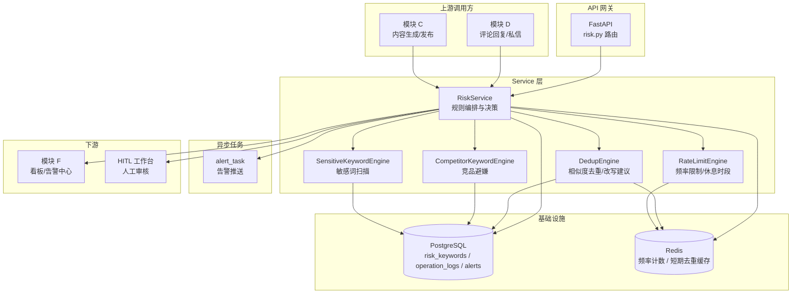
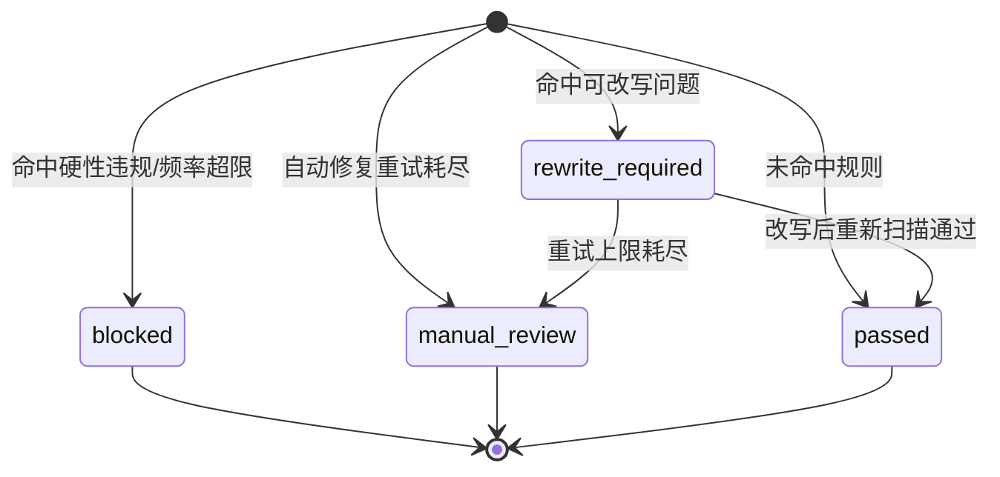
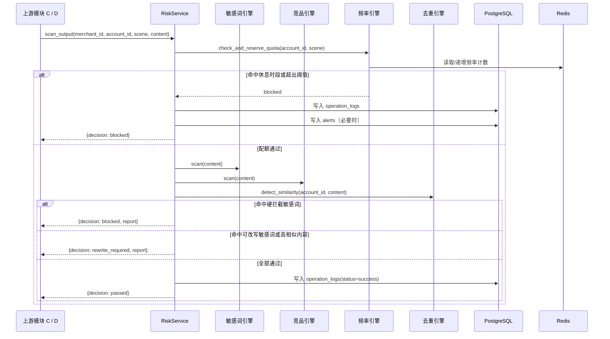
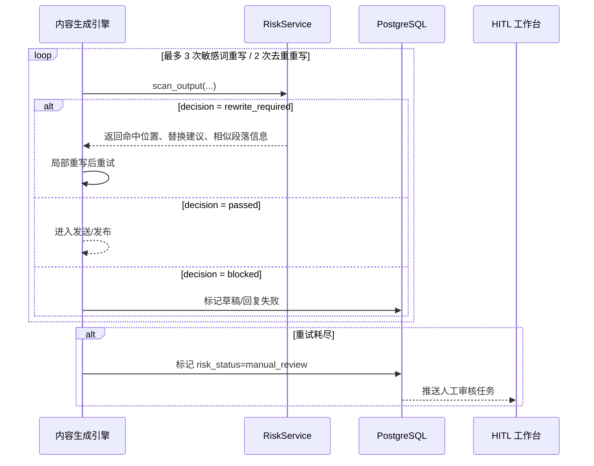
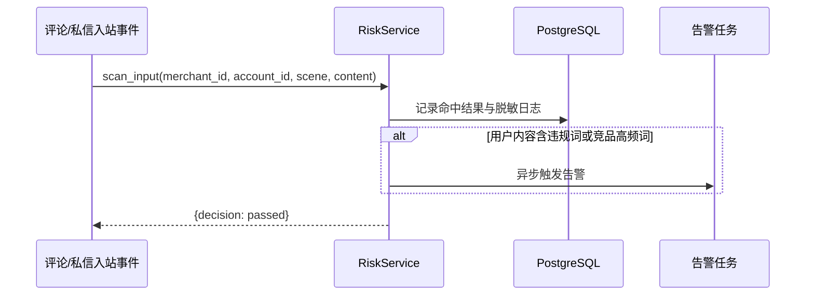

# 模块 E：风控与合规保障 — 设计文档

## 概述

模块 E 是整个小红书营销自动化 Agent 平台的横切安全层，负责解决“内容是否安全、动作是否像人、结果是否足够差异化”的问题。它不直接产出业务结果，而是在内容生成、评论回复、私信发送、笔记发布等所有关键出站动作前提供统一的风控决策，并对入站内容做合规观测。

本模块核心职责：
- 敏感词双向扫描：同时覆盖出站内容与用户入站内容
- 频率控制与流量整形：限制账号操作节奏，规避自动化检测
- 内容去重与改写触发：降低回复文本相似度，避免批量重复
- 竞品避嫌与异常告警：识别竞品提及风险并触发商家告警
- 风控报告沉淀：为模块 C、D、F 提供可追踪的检测结果与统计数据

### 设计目标

1. 前置性：所有出站内容必须在执行平台动作前完成风控扫描，且扫描耗时目标不超过 1 秒
2. 可配置：系统级规则与商家自定义规则并存，按 `merchant_id` 隔离
3. 可编排：模块 C 的内容生成链路、模块 D 的互动链路均通过统一 `RiskService` 接口接入
4. 可追踪：每次风控命中、拦截、改写、限流、告警均可写入日志并支持后续统计分析
5. 渐进降级：自动改写失败后进入人工审核，而不是直接丢弃业务请求

---

## 架构

### 模块 E 在系统中的位置



### 风控决策状态

模块 E 对单次扫描请求输出统一决策状态：



状态说明：
- `passed`：允许执行下游平台动作
- `rewrite_required`：允许内容生成引擎按报告进行局部重写后重试
- `blocked`：禁止本次自动操作，通常对应敏感词硬拦截、休息时段、频率超限
- `manual_review`：连续重试失败，需进入人工审核队列

---

## 组件与接口

### 1. API 路由层（`backend/app/api/v1/risk.py`）

路由层负责配置管理、检测调试入口和报表查询，不承担具体风控逻辑。

| Method | Path | 说明 | 请求体 / 参数 |
|--------|------|------|---------------|
| GET | `/api/v1/risk/keywords` | 获取风控关键词列表 | `?category=&is_active=` |
| POST | `/api/v1/risk/keywords` | 新增关键词 | `RiskKeywordCreateRequest` |
| PUT | `/api/v1/risk/keywords/{id}` | 更新关键词 | `RiskKeywordUpdateRequest` |
| DELETE | `/api/v1/risk/keywords/{id}` | 删除关键词 | — |
| POST | `/api/v1/risk/scan` | 手动执行内容风控扫描 | `RiskScanRequest` |
| GET | `/api/v1/risk/accounts/{id}/quota` | 查询账号当前频率配额与休息状态 | — |
| PUT | `/api/v1/risk/accounts/{id}/schedule` | 更新账号休息时间段 | `AccountRiskScheduleRequest` |
| GET | `/api/v1/risk/accounts/{id}/events` | 查询账号近期风控事件 | `?limit=50` |

说明：
- 模块 C、D 的正式调用优先走 Service 内部接口，`/risk/scan` 主要用于后台调试、人工审核辅助与联调
- 所有路由默认注入 `CurrentMerchantId` 与 `DbSession`

### 2. Service 层（`backend/app/services/risk_service.py`）

`RiskService` 是模块 E 的统一编排入口，对外暴露“扫描、限流、去重、告警、配置管理”五类能力。

```python
class RiskService:
    """风控与合规编排服务。"""

    # ── 配置管理 ──
 async def list_keywords(merchant_id: str, category: str | None, is_active: bool | None, db: AsyncSession) -> list[RiskKeyword]
    async def create_keyword(merchant_id: str, data: RiskKeywordCreateRequest, db: AsyncSession) -> RiskKeyword
    async def update_keyword(merchant_id: str, keyword_id: UUID, data: RiskKeywordUpdateRequest, db: AsyncSession) -> RiskKeyword
    async def delete_keyword(merchant_id: str, keyword_id: UUID, db: AsyncSession) -> None
    async def update_account_schedule(merchant_id: str, account_id: UUID, data: AccountRiskScheduleRequest, db: AsyncSession) -> None
    async def get_account_quota(merchant_id: str, account_id: UUID, db: AsyncSession) -> AccountRiskQuotaResponse

    # ── 核心扫描 ──
    async def scan_output(
        merchant_id: str,
        account_id: UUID,
        scene: Literal["note_publish", "comment_reply", "dm_send"],
       db: AsyncSession,
    ) -> RiskScanResult
    async def scan_input(
        merchant_id: str,
        account_id: UUID,
        scene: Literal["comment_inbound", "dm_inbound"],
        content: str,
    ) -> RiskScanResult

    # ── 节流与去重 ──
    async def check_and_reserve_quota(account_id: UUID, action: str) -> RateLimitDecision
    async def apply_humanized_delay(account_id: UUID, action: str) -> float
    async def detect_similarity(account_id: UUID, candidate: str) -> SimilarityDecision
    async def persist_reply_history(account_id: UUID, content: str) -> None

    # ── 告警与日志 ──
    async def log_risk_event(account_id: UUID, event: RiskEventLog) -> None
    async def emit_alert_if_needed(account_id: UUID, trigger: AlertTrigger) -> None
```async def check_and_reserve_quota(account_id: UUID, action: str, db: AsyncSession) -> RateLimitDecision
    async def apply_humanized_delay(account_id: UUID, action: str) -> float
    async def detect_similarity(account_id: UUID, candidate: str, db: AsyncSession) -> SimilarityDecision
    async def persist_reply_history(account_id: UUID, content: str, db: AsyncSession) -> None

    # ── 告警与日志 ──
    async def log_risk_event(account_id: UUID, event: RiskEventLog, db: AsyncSession) -> None
    async def emit_alert_if_needed(account_id: UUID, trigger: AlertTrigger, db: AsyncSession) -> None

关键设计决策：
- `scan_output()` 为模块 C、D 的统一前置门禁接口，内部串联敏感词、竞品避嫌、相似度、频率和休息时段检查
- `scan_input()` 只做检测与记录，不阻塞正常回复链路，满足需求 E1.3
- `check_and_reserve_quota()` 采用“检查即占用”策略，避免并发下超发
- 去重逻辑分为“生成前注入变体”和“发送前比对历史 100 条回复”两层

### 3. 敏感词扫描引擎

敏感词来源分为两级：
- 系统级：平台禁用词、违禁品类词、夸大宣传词
- 商家级：自定义追加词条

匹配输出包含：
- 命中词
- 命中类别
- 文本位置区间
- 替换建议
- 严重级别（`warn` / `block`）

扫描策略：
- 优先使用预编译 Trie / Aho-Corasick 自动机做多模式匹配，保证 1 秒内完成
- 同时保留原始命中文本和脱敏日志文本，前者用于重写建议，后者用于日志落库

### 4. 流量整形与频率控制

频率规则：
- `comment_reply`：每小时最多 20 次
- `dm_send`：每小时最多 50 次
- `note_publish`：每天最多 3 次

实现策略：
- Redis 维护固定窗口计数键（注意：非滑动窗口，MVP 阶段使用固定窗口简化实现，后续可升级为 sorted set 滑动窗口），建议键格式：
  - `risk:quota:{account_id}:comment_reply:{yyyyMMddHH}`
  - `risk:quota:{account_id}:dm_send:{yyyyMMddHH}`
  - `risk:quota:{account_id}:note_publish:{yyyyMMdd}`
- 休息时段配置持久化到数据库，运行时读取并缓存到 Redis
- 相邻自动操作之间注入 3 到 15 秒随机等待，由上游执行器实际 `sleep`

### 5. 内容去重与竞品避嫌

内容去重由两部分组成：
- 变体注入：在生成阶段通过同义词替换、语序微调、语气词增减拉低相似度
- 历史比对：发送前将候选回复与账号最近 100 条历史回复比较，阈值为 `0.85`
内容去重由两部分组成：
- 历史比对：发送前将候选回复与账号最近 100 条历史回复比较，阈值为 `0.85`
- 变体注入属于模块 C（内容生成引擎）的职责，E 模块只负责检测相似度并返回改写建议
竞品避嫌策略：
- 关键词列表支持商家后台维护
- 同时支持全词匹配和编辑距离 ≤ 1 的模糊匹配
- 同一账号 1 小时内命中竞品相关内容超过 10 次时触发异常告警

建议实现：
- 文本标准化：全角半角统一、大小写统一、空白折叠
- 相似度算法：优先使用 `pg_trgm` 或 Python 侧余弦/Jaccard 混合得分
- 编辑距离匹配：关键词规模较小时在应用层处理，避免数据库端模糊查询放大延迟

---

## 关键流程

### 流程 1：出站内容发布前风控扫描



### 流程 2：自动改写与人工审核降级



### 流程 3：入站内容检测与告警



---

## 数据模型

### Pydantic 请求/响应 Schema

```python
# backend/app/schemas/risk.py

class RiskKeywordCreateRequest(BaseModel):
    keyword: str = Field(..., max_length=128)
    category: Literal["platform_banned", "contraband", "exaggeration", "competitor", "custom"]
    replacement: str | None = Field(None, max_length=128)
    match_mode: Literal["exact", "fuzzy"] = "exact"
    severity: Literal["warn", "block"] = "block"
    is_active: bool = True

class RiskKeywordUpdateRequest(BaseModel):
    replacement: str | None = Field(None, max_length=128)
    match_mode: Literal["exact", "fuzzy"] | None = None
    severity: Literal["warn", "block"] | None = None
    is_active: bool | None = None

class RiskScanRequest(BaseModel):
    account_id: UUID
    scene: Literal["note_publish", "comment_reply", "dm_send", "comment_inbound", "dm_inbound"]
    content: str = Field(..., min_length=1, max_length=5000)

class RiskHitResponse(BaseModel):
    keyword: str
    category: str
    start: int
    end: int
    replacement: str | None
    severity: str

class RiskScanResponse(BaseModel):
    passed: bool
    decision: Literal["passed", "rewrite_required", "blocked", "manual_review"]
    hits: list[RiskHitResponse]
    similarity_score: float | None
    matched_history_id: UUID | None
    retryable: bool

class AccountRiskScheduleRequest(BaseModel):
    rest_windows: list[str] = Field(..., description='["00:00-08:00", "13:00-14:00"]')

class AccountRiskQuotaResponse(BaseModel):
    account_id: UUID
    comment_reply_used: int
    comment_reply_limit: int
    dm_send_used: int
    dm_send_limit: int
    note_publish_used: int
    note_publish_limit: int
    in_rest_window: bool

class RiskEventResponse(BaseModel):
    operation_type: str
    status: str
    risk_decision: str
    violations: list[str]
    created_at: datetime
```

### SQLAlchemy ORM 模型

```python
# backend/app/models/risk.py

class RiskKeyword(Base):
    __tablename__ = "risk_keywords"

    id: Mapped[UUID] = mapped_column(primary_key=True, default=uuid4)
    merchant_id: Mapped[UUID | None] = mapped_column(index=True, nullable=True)
    keyword: Mapped[str] = mapped_column(String(128), nullable=False)
    category: Mapped[str] = mapped_column(
        Enum("platform_banned", "contraband", "exaggeration", "competitor", "custom", name="risk_keyword_category_enum"),
        nullable=False,
    )
    replacement: Mapped[str | None] = mapped_column(String(128))
    match_mode: Mapped[str] = mapped_column(
        Enum("exact", "fuzzy", name="risk_match_mode_enum"),
        default="exact",
        nullable=False,
    )
    severity: Mapped[str] = mapped_column(
        Enum("warn", "block", name="risk_severity_enum"),
        default="block",
        nullable=False,
    )
    is_active: Mapped[bool] = mapped_column(Boolean, default=True, nullable=False)
    created_at: Mapped[datetime] = mapped_column(TIMESTAMPTZ, server_default=func.now())

    __table_args__ = (
        UniqueConstraint("merchant_id", "keyword", "category", name="uq_risk_keyword_scope"),
    )


class AccountRiskConfig(Base):
    __tablename__ = "account_risk_configs"

    id: Mapped[UUID] = mapped_column(primary_key=True, default=uuid4)
    account_id: Mapped[UUID] = mapped_column(ForeignKey("accounts.id", ondelete="CASCADE"), unique=True, nullable=False)
    rest_windows: Mapped[list[str]] = mapped_column(ARRAY(Text), default=list)
    comment_reply_limit_per_hour: Mapped[int] = mapped_column(Integer, default=20)
    dm_send_limit_per_hour: Mapped[int] = mapped_column(Integer, default=50)
    note_publish_limit_per_day: Mapped[int] = mapped_column(Integer, default=3)
    dedup_similarity_threshold: Mapped[float] = mapped_column(Float, default=0.85)
    competitor_alert_threshold_per_hour: Mapped[int] = mapped_column(Integer, default=10)
    updated_at: Mapped[datetime] = mapped_column(TIMESTAMPTZ, server_default=func.now(), onupdate=func.now())


class ReplyHistory(Base):
    __tablename__ = "reply_histories"

    id: Mapped[UUID] = mapped_column(primary_key=True, default=uuid4)
    account_id: Mapped[UUID] = mapped_column(ForeignKey("accounts.id", ondelete="CASCADE"), index=True, nullable=False)
    content: Mapped[str] = mapped_column(Text, nullable=False)
    normalized_content: Mapped[str] = mapped_column(Text, nullable=False)
    similarity_hash: Mapped[str | None] = mapped_column(String(64))
    source_type: Mapped[str] = mapped_column(
        Enum("comment_reply", "dm_send", name="reply_history_source_type_enum"),
        nullable=False,
    )
    source_record_id: Mapped[UUID | None] = mapped_column(nullable=True)
    created_at: Mapped[datetime] = mapped_column(TIMESTAMPTZ, server_default=func.now())
```


class OperationLog(Base):
    """风控操作日志，记录每次扫描的决策结果。"""
    __tablename__ = "operation_logs"

    id: Mapped[UUID] = mapped_column(primary_key=True, default=uuid4)
    merchant_id: Mapped[UUID] = mapped_column(index=True, nullable=False)
    account_id: Mapped[UUID] = mapped_column(ForeignKey("accounts.id", ondelete="CASCADE"), nullable=False)
    operation_type: Mapped[str] = mapped_column(
        Enum("note_publish", "comment_reply", "dm_send", "comment_inbound", "dm_inbound", name="operation_type_enum"),
        nullable=False,
    )
    status: Mapped[str] = mapped_column(
        Enum("success", "blocked", "rewrite_required", "manual_review", name="operation_status_enum"),
        nullable=False,
    )
    risk_decision: Mapped[str] = mapped_column(String(32), nullable=False)
    violations: Mapped[list[str]] = mapped_column(ARRAY(Text), default=list)
    content_preview: Mapped[str | None] = mapped_column(Text, nullable=True)  # 脱敏后的内容摘要
    created_at: Mapped[datetime] = mapped_column(TIMESTAMPTZ, server_default=func.now())

    __table_args__ = (
        Index("ix_operation_logs_account_type_created", "account_id", "operation_type", created_at.desc()),
    )


class Alert(Base):
    """风控告警记录。"""
    __tablename__ = "alerts"

    id: Mapped[UUID] = mapped_column(primary_key=True, default=uuid4)
    merchant_id: Mapped[UUID] = mapped_column(index=True, nullable=False)
    account_id: Mapped[UUID | None] = mapped_column(ForeignKey("accounts.id", ondelete="SET NULL"), nullable=True)
    module: Mapped[str] = mapped_column(String(32), nullable=False, default="risk")
    alert_type: Mapped[str] = mapped_column(String(64), nullable=False)
    message: Mapped[str] = mapped_column(Text, nullable=False)
    severity: Mapped[str] = mapped_column(
        Enum("info", "warning", "critical", name="alert_severity_enum"),
        default="warning",
        nullable=False,
    )
    is_resolved: Mapped[bool] = mapped_column(Boolean, default=False, nullable=False)
    created_at: Mapped[datetime] = mapped_column(TIMESTAMPTZ, server_default=func.now())

    __table_args__ = (
        Index("ix_alerts_merchant_module_created", "merchant_id", "module", created_at.desc()),
    )

### 数据库约束与索引

| 表 | 约束/索引 | 说明 |
|------|-----------|------|
| risk_keywords | `UNIQUE(merchant_id, keyword, category)` | 同一作用域下关键词不重复 |
| risk_keywords | `INDEX(merchant_id, category, is_active)` | 提升分类加载效率 |
| account_risk_configs | `UNIQUE(account_id)` | 每个账号一份风控配置 |
| reply_histories | `INDEX(account_id, created_at DESC)` | 查询最近 100 条历史回复 |
| operation_logs | `INDEX(account_id, operation_type, created_at DESC)` | 用于风控事件回溯 |
| alerts | `INDEX(merchant_id, module, created_at DESC)` | 用于告警中心筛选 |

### Redis 键设计

| Key Pattern | 用途 | TTL |
|-------------|------|-----|
| `risk:quota:{account_id}:{action}:{bucket}` | 频率限制计数 | 1 小时 / 1 天 |
| `risk:rest:{account_id}` | 账号休息时段缓存 | 24 小时 |
| `risk:competitor_hits:{account_id}:{yyyyMMddHH}` | 竞品命中次数 | 1 小时 |
| `risk:reply_recent:{account_id}` | 最近回复摘要缓存 | 24 小时 |

---

## 正确性属性
> 编号延续全局属性列表（architecture.md），模块内简称 E-P1 ~ E-P3。

### 属性 E-P1（全局 #13）：敏感词扫描覆盖所有出站内容
### 属性 13：敏感词扫描覆盖所有出站内容

对于任意准备发布的笔记、评论回复、私信，风控扫描都必须在平台动作执行前完成，且扫描耗时不超过 1 秒。

**验证需求：E1.2**

---
### 属性 E-P2（全局 #14）：操作频率上限约束
### 属性 14：操作频率上限约束

对于任意账号，在任意 1 小时滑动窗口内，评论回复次数不超过 20，私信发送次数不超过 50；笔记发布在任意自然日内不超过 3 次。超阈值时自动操作必须被阻止。

**验证需求：E2.1, E2.2**

---

### 属性 15：回复内容去重

对于任意待发送回复，其与该账号最近 100 条历史回复的最大文本相似度必须低于 `0.85`；若超过阈值，则必须触发改写流程，最多重试 2 次。

**验证需求：E3.1, E3.2**

---

## 设计补充

- 模块 E 不直接负责“如何改写”，只负责判定“为什么要改写、改写哪一段、还能重试几次”
- 风控决策结果建议以统一对象在模块 C、D 中传递，避免各处自行解析散乱字典
- 高频查询走 Redis，规则配置与审计记录走 PostgreSQL，保持性能与可追踪性平衡
- 对入站违规内容只记录不拦截，避免破坏实时客服链路的响应时延目标
