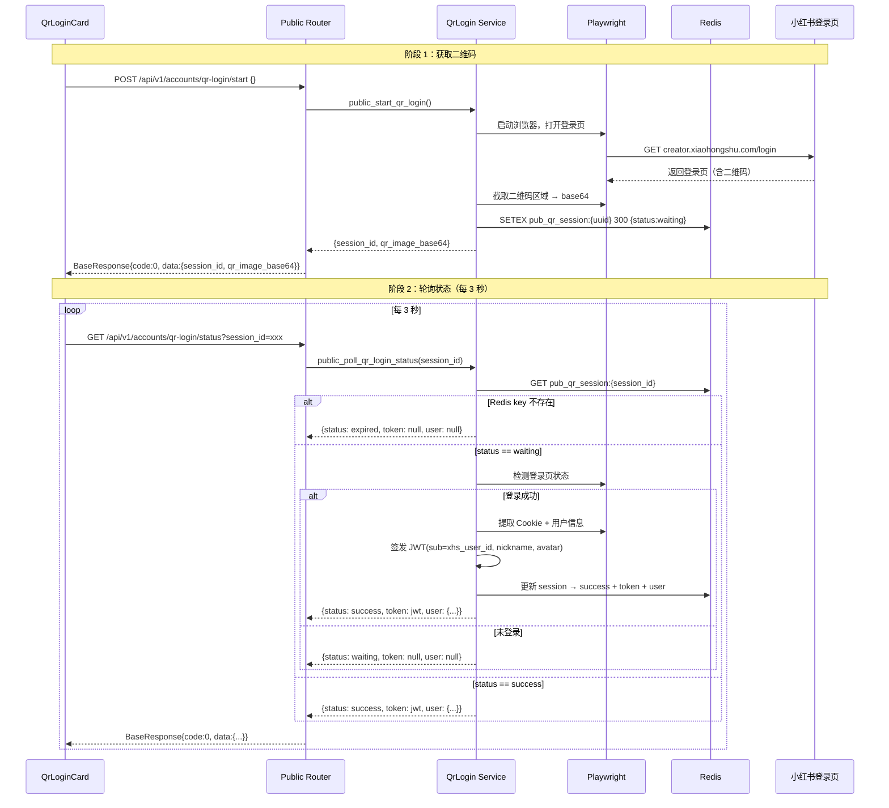

# 公开扫码登录 API — 设计文档

## 概述

本设计为前端登录页（`QrLoginCard` 组件）提供一组无需认证的公开扫码登录 API。与现有的已认证扫码登录接口（`/{account_id}/qr-login/`）并存，互不影响。

核心流程：
1. 前端调用 `POST /api/v1/accounts/qr-login/start` 获取二维码图片和 session_id
2. 前端每 3 秒轮询 `GET /api/v1/accounts/qr-login/status?session_id=xxx`
3. 扫码成功后，后端签发 JWT，前端存入 `localStorage` 完成认证闭环

### 设计目标

1. **零改动对接**：响应格式完全匹配前端 `QrLoginCard` 和 `api-client` 的期望
2. **路由隔离**：公开路由作为独立 `APIRouter`，不依赖 `CurrentMerchantId`，不影响现有已认证接口
3. **安全性**：Redis 会话 TTL 自动过期，JWT 使用统一配置签发
4. **架构一致性**：遵循项目分层架构，路由层只做参数校验和响应封装，业务逻辑在 Service 层

### 关键设计决策

| 决策 | 选择 | 理由 |
|------|------|------|
| 路由注册顺序 | 公开路由在 `accounts.router` 之前注册 | FastAPI 路由匹配按注册顺序，公开路由 `/accounts/qr-login/start` 需优先于 `/{account_id}/qr-login/start` |
| Redis key 前缀 | `pub_qr_session:` | 与现有已认证扫码的 `qr_session:` 前缀区分，避免冲突 |
| JWT payload | `sub` + `nickname` + `avatar` + `exp` | `sub` 存 `xhs_user_id`，与现有 `get_current_merchant_id` 解析逻辑兼容 |
| Service 函数位置 | 新增独立函数在 `account_service.py` | 复用现有模块，避免创建新文件，但函数命名以 `public_` 前缀区分 |

---

## 架构

### 公开扫码登录在系统中的位置

```mermaid
graph TB
    subgraph 前端
        QR[QrLoginCard 组件<br/>登录页]
    end

    subgraph API 网关
        PUB[Public QrLogin Router<br/>无认证]
        AUTH[Accounts Router<br/>JWT 认证]
    end

    subgraph Service 层
        SVC[account_service.py<br/>public_start_qr_login<br/>public_poll_qr_login_status]
    end

    subgraph 基础设施
        RD[(Redis<br/>pub_qr_session:{session_id})]
        PW[Playwright<br/>小红书登录页截图]
    end

    subgraph 外部
        XHS[小红书<br/>creator.xiaohongshu.com/login]
    end

    QR -->|POST /qr-login/start| PUB
    QR -->|GET /qr-login/status| PUB
    PUB --> SVC
    AUTH -->|已认证扫码| SVC
    SVC --> RD
    SVC --> PW
    PW --> XHS
```

### 请求流程时序图



---

## 组件与接口

### 1. Public QrLogin Router（`backend/app/api/v1/qr_login.py`，新建文件）

独立的公开路由模块，不依赖任何认证中间件。

| Method | Path | 说明 | 认证 |
|--------|------|------|------|
| POST | `/api/v1/accounts/qr-login/start` | 启动扫码登录，返回二维码 | 无 |
| GET | `/api/v1/accounts/qr-login/status` | 轮询扫码状态 | 无 |

```python
# backend/app/api/v1/qr_login.py
router = APIRouter(prefix="/accounts/qr-login", tags=["扫码登录（公开）"])

@router.post("/start", response_model=BaseResponse[QrLoginStartResponse])
async def public_start_qr_login() -> BaseResponse[QrLoginStartResponse]:
    """启动公开扫码登录，返回二维码图片和 session_id。"""
    ...

@router.get("/status", response_model=BaseResponse[PublicQrLoginStatusResponse])
async def public_poll_qr_login_status(
    session_id: str = Query(...),
) -> BaseResponse[PublicQrLoginStatusResponse]:
    """轮询公开扫码登录状态。"""
    ...
```

### 2. Service 层新增函数（`backend/app/services/account_service.py`）

在现有 `account_service.py` 中新增两个公开扫码登录函数：

```python
# 新增常量
PUB_QR_SESSION_PREFIX = "pub_qr_session:"

async def public_start_qr_login() -> dict[str, str]:
    """启动公开扫码登录。
    
    Returns:
        {"session_id": str, "qr_image_base64": str}
    """
    ...

async def public_poll_qr_login_status(session_id: str) -> dict:
    """轮询公开扫码登录状态。
    
    Returns:
        {"status": str, "token": str | None, "user": dict | None}
    """
    ...

def _create_jwt_token(xhs_user_id: str, nickname: str, avatar: str | None) -> str:
    """签发 JWT token。"""
    ...
```

### 3. 路由注册（`backend/app/main.py`）

```python
from app.api.v1 import qr_login, accounts, ...

# 公开路由必须在 accounts.router 之前注册
app.include_router(qr_login.router, prefix="/api/v1")
app.include_router(accounts.router, prefix="/api/v1")
```

---

## 数据模型

### 新增 Pydantic Schema（`backend/app/schemas/account.py`）

```python
class UserInfo(BaseModel):
    """用户信息（JWT 签发后返回给前端）。"""
    nickname: str
    avatar: str | None = None
    xhs_user_id: str

class PublicQrLoginStatusResponse(BaseModel):
    """公开扫码登录状态轮询响应。"""
    status: Literal["waiting", "success", "expired"]
    token: str | None = None
    user: UserInfo | None = None
```

### Redis 会话数据结构

```json
// Key: pub_qr_session:{session_id}
// TTL: 300 秒（5 分钟）
{
    "status": "waiting",           // waiting | success | expired
    "created_at": "2024-01-01T00:00:00+00:00",
    "token": null,                 // 登录成功后填入 JWT
    "user": null                   // 登录成功后填入 {nickname, avatar, xhs_user_id}
}
```

### JWT Payload 结构

```json
{
    "sub": "xhs_user_id_123",     // 小红书用户 ID
    "nickname": "商家昵称",
    "avatar": "https://...",       // 可能为 null
    "exp": 1704153600              // 过期时间戳
}
```

### 现有 Schema 不变

- `QrLoginStartResponse`：复用，`session_id` + `qr_image_base64`
- `QrLoginStatusResponse`：保持不变，已认证接口继续使用
- `BaseResponse`：统一响应包装，`{code: 0, message: "success", data: T}`

